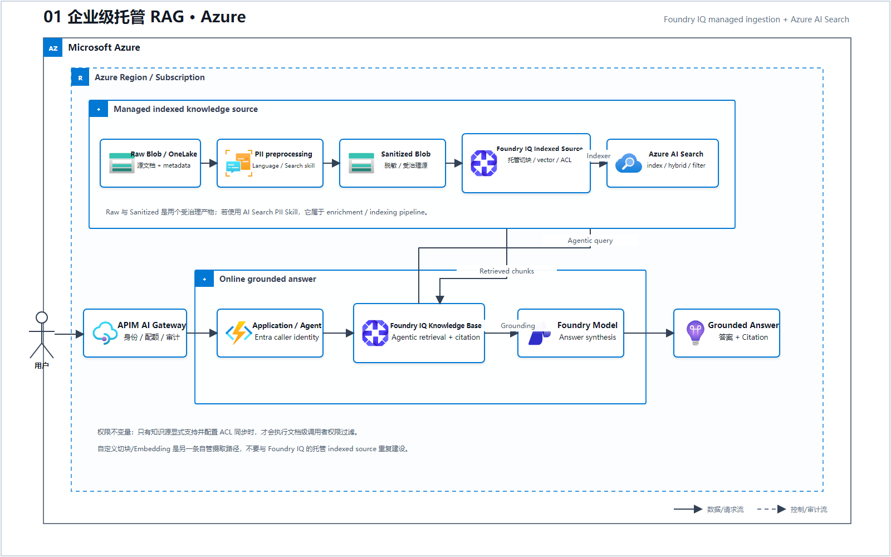
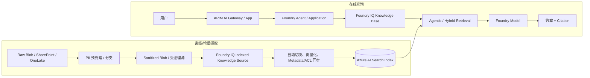

# 01 企业级托管 RAG（Microsoft Foundry）

> 系列：AWS AIP-C01 经典架构的 Azure 1:1 功能映射
>
> 题号沿用 `architecture` 中的 AWS 源场景，用于交叉学习；不是 Azure 认证考试题号。

## Azure 架构图

可编辑源图：[01-managed-rag-azure.svg](diagrams/01-managed-rag-azure.svg)

## 十二套架构总览

| # | Azure Foundry 架构 | AWS 源场景 | Azure 核心能力 |
|---|---|---|---|
| 1 | [企业级托管 RAG](./01_企业级托管_RAG.md) | Bedrock Knowledge Bases + OpenSearch | Foundry IQ、Azure AI Search、Foundry Models、Blob Storage |
| 2 | [Agentic RAG 与多 Agent](./02_Agentic_RAG_与多_Agent.md) | Bedrock Agents + AgentCore | Foundry Agent Service、Microsoft Agent Framework、Foundry IQ、APIM AI Gateway |
| 3 | [安全 Text-to-SQL](./03_安全_Text-to-SQL.md) | Bedrock + Lambda + RDS | Foundry Models、Azure Functions、Azure SQL、Managed Identity |
| 4 | [Guardrails 纵深防御](./04_Guardrails_纵深防御.md) | Bedrock Guardrails + IAM | Foundry Guardrails、Content Safety、Prompt Shields、Azure Policy、APIM |
| 5 | [Prompt 与运行时配置生命周期](./05_Prompt_与运行时配置生命周期.md) | Prompt Management + AppConfig | Git 版本化 Prompt、Foundry Evaluation、Azure App Configuration、Key Vault |
| 6 | [评估驱动的发布门禁](./06_评估驱动的发布门禁.md) | Bedrock Evaluation + CodePipeline | Foundry Cloud Evaluation、Azure DevOps/GitHub Actions、Application Insights |
| 7 | [GenAI 可观测性与成本监控](./07_GenAI_可观测性与成本监控.md) | CloudWatch + X-Ray | Application Insights、Azure Monitor、Log Analytics、Cost Management |
| 8 | [Serverless 编排与人工审批](./08_Serverless_编排与人工审批.md) | Step Functions + Lambda | Durable Functions、Logic Apps、Azure Functions、Event Grid、Service Bus |
| 9 | [低延迟流式 AI](./09_低延迟流式_AI.md) | Bedrock Streaming + WebSocket | Foundry Responses Streaming、Web PubSub/SignalR、Container Apps、Azure Speech |
| 10 | [私有网络、多订阅与数据驻留](./10_私有网络_多账户与数据驻留.md) | PrivateLink + IAM/SCP | Foundry Managed/BYO VNet、Private Endpoint、Entra ID、RBAC、Azure Policy |
| 11 | [多模态内容摄取流水线](./11_多模态内容摄取流水线.md) | BDA + Textract/Transcribe | Content Understanding、Document Intelligence、Speech、Vision、Durable Functions |
| 12 | [模型路由、容量与韧性](./12_模型路由_容量与韧性.md) | AppConfig + PT + CRI | Foundry Model Router、部署类型、APIM AI Gateway、App Configuration、Service Bus |

## 标准架构

## 1:1 功能映射

| AWS 能力 | Azure 对应能力 | 说明 |
|---|---|---|
| S3 数据源 | Azure Blob Storage、SharePoint、OneLake | Foundry IQ 支持索引型与远程知识源 |
| Bedrock Knowledge Bases | Foundry IQ Knowledge Base | 托管知识层；底层检索基础设施是 Azure AI Search |
| OpenSearch Serverless | Azure AI Search | Vector、Keyword、Hybrid、Semantic Ranker、Metadata Filter |
| Titan Embeddings | Foundry Models 中的 Embedding 部署 | Indexed Knowledge Source 会托管向量化；只有自定义摄取流水线才需要显式调用 Embedding 部署 |
| RetrieveAndGenerate | Agent/Application 调用 Foundry IQ，再调用 Foundry Model | 返回可追溯的 grounding data 与 citation |
| Comprehend PII | Azure AI Language PII；必要时结合 Purview 分类 | 摄取前识别、遮蔽或隔离 PII；也可以把 PII Skill 放在 AI Search enrichment pipeline 内；Content Safety 不是通用 PII 替代品 |

## 为什么它仍然是经典架构

Foundry IQ 把知识源、权限、检索策略和引用从 Prompt 中分离出来。Azure AI Search 负责索引、向量/关键字混合检索和语义排序；Foundry Model 只负责基于检索上下文生成答案。

关键设计点：

- 普通文档问答：Foundry IQ + Azure AI Search；
- 复杂问题：启用 agentic retrieval，让模型拆分子查询并行检索；
- 权限敏感数据：使用 Entra 调用者身份，并确认知识源支持 ACL 同步；
- 关系型数据与向量共存：Azure Database for PostgreSQL + `pgvector`；
- 业务数据已在 Cosmos DB：可使用 Cosmos DB Vector Search；
- 关系和语义模型本身是核心：考虑 Fabric IQ/ontology，而不是把所有数据强塞进普通向量索引。

## 常见误判

- Foundry IQ **依赖 Azure AI Search**；它不是另一个独立向量数据库。
- Indexed Knowledge Source 会通过 Azure AI Search indexer 托管切块、向量化、Metadata 提取和受支持数据源的 ACL 同步；不要在图外再重复搭一套 Embedding 流水线。自定义切块或自定义向量模型时，才改走自管摄取。
- PII 预处理必须明确产物边界：优先把原始对象保留在受限 Raw 区，把脱敏/分类后的 Sanitized Blob 交给知识源；若使用 AI Search PII Skill，则应标注它属于 enrichment/indexing pipeline，而不是独立的在线推理步骤。
- Content Safety 不能替代 RAG。护栏负责检测和阻止风险，不会自动提供企业事实。
- Private Endpoint 不能自动实现文档级权限；必须配置 Entra、RBAC/ACL 和知识源权限同步。
- 只有固定 SQL 聚合的结构化数据应走 Text-to-SQL，不要先转成向量再绕一圈。

## 官方依据

- [Foundry IQ 概览](https://learn.microsoft.com/en-us/azure/ai-foundry/agents/concepts/what-is-foundry-iq?view=foundry)
- [Azure 上的 RAG 信息检索设计](https://learn.microsoft.com/en-us/azure/architecture/ai-ml/guide/rag/rag-information-retrieval)
- [Microsoft Foundry AI 产品选型](https://learn.microsoft.com/en-us/azure/architecture/ai-ml/guide/data-science-and-machine-learning)

---

## 系列导航

- 系列总览：[01 企业级托管 RAG](./01_企业级托管_RAG.md)
- 下一篇：[02 Agentic RAG 与多 Agent](./02_Agentic_RAG_与多_Agent.md)
