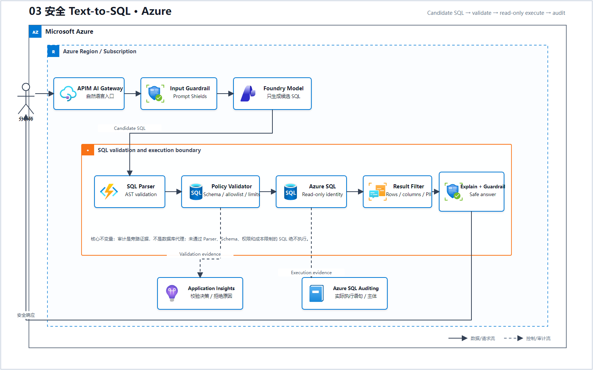
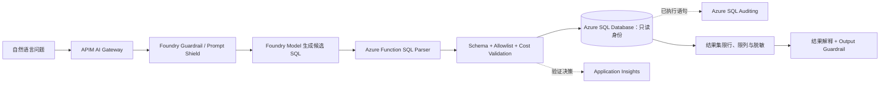

# 03 安全 Text-to-SQL（Microsoft Foundry）

> AWS 源场景：Bedrock Guardrails → FM → Lambda SQL Parser → RDS Data API → Audit。

## Azure 架构图

可编辑源图：[03-secure-text-to-sql-azure.svg](diagrams/03-secure-text-to-sql-azure.svg)

## 标准架构

## 必须保留的安全链

1. Prompt Shields/Content Safety 检查输入攻击和风险内容；
2. 模型只生成候选 SQL，不直接获得数据库执行权限；
3. Azure Function 解析 AST，限制为只读语句、允许表/列、行数和超时；
4. 使用 Azure SQL 元数据验证 Schema；
5. 以最小权限 Managed Identity 连接数据库；
6. Parser/校验决策写入 Application Insights，数据库实际执行记录写入 Azure SQL Auditing；审计旁路留证，**不充当 SQL 执行代理**；
7. 返回结果先限行、限列和脱敏，再执行输出内容与 PII 检查。

## 与 AWS 的关键差异

Azure SQL 没有与 RDS Data API 完全相同的通用执行层。本架构使用 Azure Functions/Container Apps 中的驱动程序和 Managed Identity 建立受控连接，因此连接池、超时和最小权限是应用层必须承担的职责。

## 与 RAG 的分界

| 数据和问题 | 架构方向 |
|---|---|
| 文档段落、政策、知识文章 | Foundry IQ / RAG |
| 关系表上的过滤、聚合、联接 | 安全 Text-to-SQL |
| 业务语义已经在 Fabric | Fabric IQ/Data Agent，再由 Foundry Agent 调用 |
| 多跳实体关系 | 图/ontology 模式，不是普通 Text-to-SQL |

## 官方依据

- [Foundry Guardrails](https://learn.microsoft.com/en-us/azure/foundry/guardrails/guardrails-overview)
- [Azure SQL 的 Microsoft Entra 服务主体与托管身份](https://learn.microsoft.com/en-us/azure/azure-sql/database/authentication-aad-service-principal)
- [Azure SQL Auditing](https://learn.microsoft.com/en-us/azure/azure-sql/database/auditing-overview)

---

## 系列导航

- 上一篇：[02 Agentic RAG 与多 Agent](./02_Agentic_RAG_与多_Agent.md)
- 下一篇：[04 Guardrails 纵深防御](./04_Guardrails_纵深防御.md)
