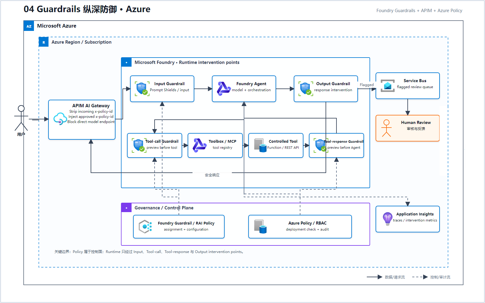
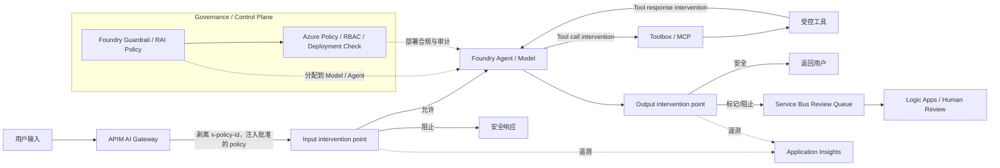

# 04 Guardrails 纵深防御（Microsoft Foundry）

> AWS 源场景：ApplyGuardrail Pre/Post、IAM/SCP 强制、SQS/A2I 人工升级。

## Azure 架构图

可编辑源图：[04-guardrails-defense-azure.svg](diagrams/04-guardrails-defense-azure.svg)

## 完整控制链

## Azure 控制点

| 风险 | Foundry/Azure 控制 |
|---|---|
| 有害内容 | Content filters |
| 直接或间接 Prompt Injection | Prompt Shields |
| 禁止词、业务黑名单 | Blocklists + APIM Policy |
| Agent 工具外发和工具返回 | Agent tool-call/tool-response guardrails（预览，仅适用于 Foundry Agent Service Agent） |
| 敏感数据泄漏 | Foundry PII control（预览）或 Azure AI Language PII + Microsoft Purview |
| 所有项目必须满足最低护栏 | Foundry Guardrail/RAI Policy 绑定 Model/Agent；Azure Policy + RBAC 在控制面检查部署合规 |
| 调用方不得绕过 | APIM 剥离请求级 `x-policy-id` 并注入批准值；只公开 APIM 私有/受控入口，阻断直接模型端点 |

## 与 IAM `GuardrailIdentifier` 的差异

Azure 没有完全相同的单次调用条件键。等效防线是：

1. 护栏绑定到模型/Agent；
2. Azure Policy/Foundry Guardrail/RAI Policy 约束部署合规；
3. APIM AI Gateway 作为唯一调用入口；
4. RBAC、Private Endpoint 和网络规则阻断绕过；
5. Activity Log、Application Insights 和 Purview 保留证据。

请求数据路径中只有 Input、Tool call、Tool response 和 Output intervention points；Guardrail/RAI Policy 与 Azure Policy 属于控制面，通过分配、部署检查和审计影响运行时配置，不是每个 Prompt 经过的网络跳点。

## 成熟度边界

- 模型的用户输入/最终输出 Guardrail 是稳定运行时干预点；Agent Guardrail 整体仍为预览。
- Tool call、Tool response 和 Hosted Agent 网络出口控制均为预览，且不会自动应用到注册在 Control Plane 的任意第三方 Agent。
- Tool guardrail 必须围绕 `Agent → Tool → Agent` 链路分别标出 Tool call 和 Tool response；它不是最终 Output 之后的一个合并检查点。
- `Service Bus + Logic Apps + 审核台` 是自建人工升级工作流，不是 Azure 原生 A2I 的同名等价服务。

## Guardrails 不能替代什么

- 不能替代 Foundry IQ 提供权威资料；
- 不能替代 SQL Parser、Schema 和权限验证；
- 不能替代人工高风险审批；
- 不能替代 Azure Monitor、Activity Log 和数据库审计。

## 官方依据

- [Foundry Guardrails and controls](https://learn.microsoft.com/en-us/azure/foundry/guardrails/guardrails-overview)
- [Foundry 合规与安全管理](https://learn.microsoft.com/en-us/azure/foundry/control-plane/how-to-manage-compliance-security)
- [APIM AI Gateway 能力](https://learn.microsoft.com/en-us/azure/api-management/genai-gateway-capabilities)

---

## 系列导航

- 上一篇：[03 安全 Text-to-SQL](./03_安全_Text-to-SQL.md)
- 下一篇：[05 Prompt 与运行时配置生命周期](./05_Prompt_与运行时配置生命周期.md)
