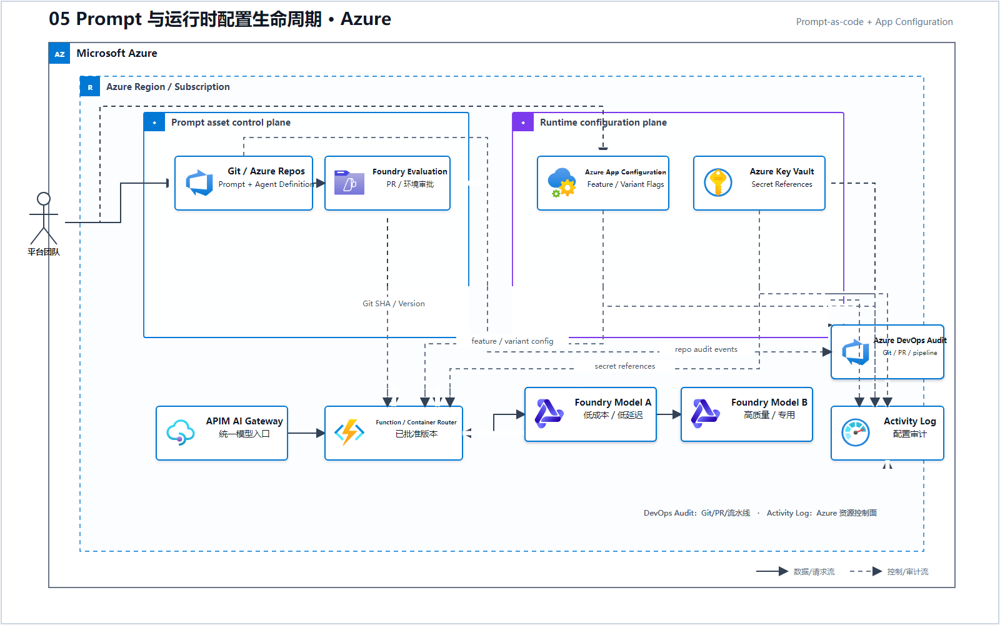
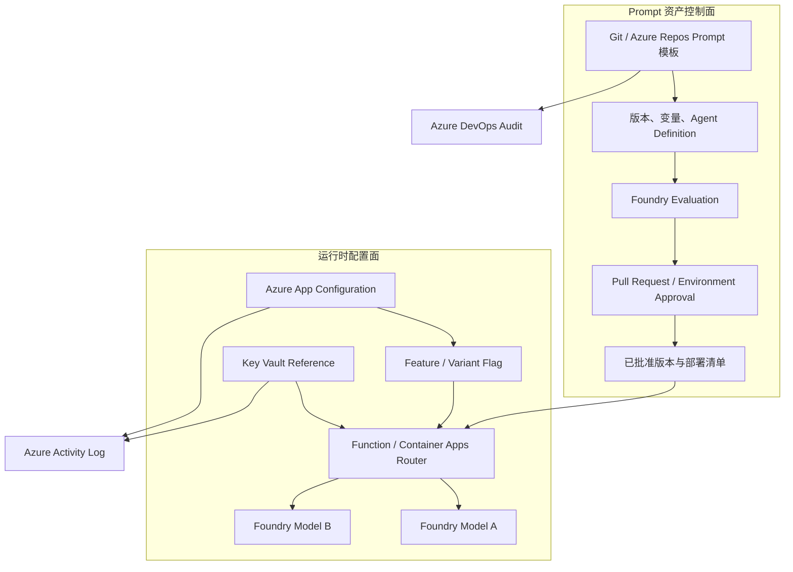

# 05 Prompt 与运行时配置生命周期（Microsoft Foundry）

> AWS 源场景：Bedrock Prompt Management + AWS AppConfig Agent。

## Azure 架构图

可编辑源图：[05-prompt-config-lifecycle-azure.svg](diagrams/05-prompt-config-lifecycle-azure.svg)

## 两条控制线

## 三个概念不要混淆

| 需求 | Azure 实现 |
|---|---|
| Prompt 模板、变量和版本 | Git/Azure Repos + Agent Definition/应用配置；PR 审批 |
| Prompt 质量比较 | Foundry Cloud Evaluation + 测试集 + LLM-as-a-Judge |
| 无需重新部署切模型/参数 | Azure App Configuration Feature/Variant Flag |
| 密钥和端点引用 | Key Vault Reference + Managed Identity |
| 多步骤、重试和补偿 | Durable Functions/Logic Apps，而不是 Feature Flag |

## 与 Bedrock Prompt Management 的差异

新 Microsoft Foundry 中没有需要强行假装成 Bedrock Prompt Management 的完全同名托管资产。生产级等效方案是把 Prompt 和 Agent 定义作为代码版本化，通过 Foundry Evaluation 形成质量证据，再由 CI/CD 审批发布；运行时选择交给 App Configuration。Prompt Flow 主要属于 Foundry classic 路径，不应在新项目里默认当作唯一答案。

## 发布规则

- Prompt 版本和运行时开关分开；
- Feature Flag 只指向已评估、已批准的版本；
- App Configuration 使用标签区分环境，并启用快照/回滚；
- Key Vault 只保存秘密，不保存可频繁变化的业务 Prompt；
- Azure DevOps Audit 记录 Git/PR/流水线活动；Azure Activity Log 记录 App Configuration、Key Vault 和 Azure 资源控制面变更，两者是不同的审计源；
- 记录评估 Run ID、Git SHA、配置 Snapshot 和生产 Deployment ID。

## 官方依据

- [Azure App Configuration Feature Flags](https://learn.microsoft.com/en-us/azure/azure-app-configuration/manage-feature-flags)
- [Foundry Cloud Evaluation](https://learn.microsoft.com/en-us/azure/foundry/how-to/develop/cloud-evaluation)
- [Prompt Flow（Foundry classic，注意适用范围）](https://learn.microsoft.com/en-us/azure/ai-foundry/concepts/prompt-flow)

---

## 系列导航

- 上一篇：[04 Guardrails 纵深防御](./04_Guardrails_纵深防御.md)
- 下一篇：[06 评估驱动的发布门禁](./06_评估驱动的发布门禁.md)
