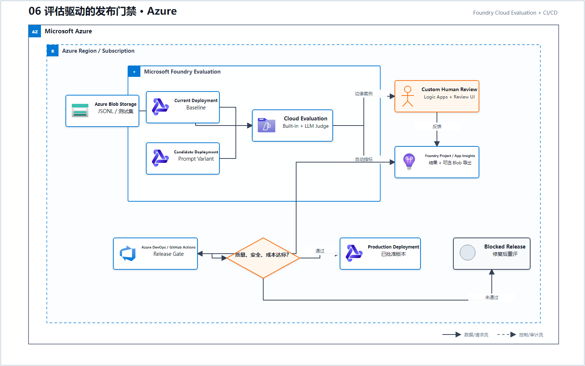
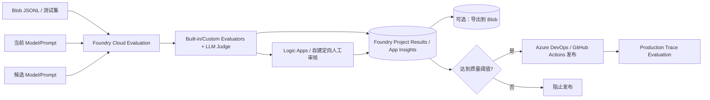

# 06 评估驱动的发布门禁（Microsoft Foundry）

> AWS 源场景：Bedrock Evaluation + S3 JSONL + CodePipeline + A2I。

## Azure 架构图

可编辑源图：[06-evaluation-release-gate-azure.svg](diagrams/06-evaluation-release-gate-azure.svg)

## 标准架构

## 指标层次

| 评估目标 | Azure Foundry 方法 |
|---|---|
| Groundedness、Relevance、Coherence | Foundry 内置评估器 |
| 自定义业务事实、SQL 安全、格式 | Custom evaluator |
| 候选与基线比较 | 固定数据集 + Pairwise/LLM-as-a-Judge |
| 内容风险与越狱 | Risk and safety evaluation |
| Agent 工具选择和任务完成 | Agent/trace evaluator |
| 生产漂移和失败案例 | Application Insights traces + trace evaluation |

## 门禁不变量

- 固定测试集、评估器版本和阈值；
- 记录模型 Deployment、Prompt Git SHA、Evaluation Run ID；
- 边缘案例进入人工审核，不以平均分掩盖高风险失败；
- 离线门禁通过后，生产继续按 trace/conversation 采样评估；
- 质量、安全、成本和延迟同时达标才发布。

Logic Apps 只负责把边缘样本送入你自己的审核表单、Teams/邮件或业务审核台，并持久化审核人和结论；它不是 Azure 原生 A2I 服务。Blob 也不是 Cloud Evaluation 的默认结果库，图中的 Blob 是显式导出/归档路径。

## Model Router 特别说明

Foundry Evaluation 服务当前不直接集成 Model Router。评估 Model Router 时使用专用评估工具，把 Router 与固定基线模型在质量、成本和延迟上做对照，不能把普通 Evaluation Job 的结果直接套用。

## 官方依据

- [Foundry Cloud Evaluation](https://learn.microsoft.com/en-us/azure/foundry/how-to/develop/cloud-evaluation)
- [评估已部署交互与 traces](https://learn.microsoft.com/en-us/azure/foundry/observability/how-to/cloud-evaluation-deployed-interactions)
- [Model Router 评估要求](https://learn.microsoft.com/en-us/azure/foundry/openai/how-to/model-router)

---

## 系列导航

- 上一篇：[05 Prompt 与运行时配置生命周期](./05_Prompt_与运行时配置生命周期.md)
- 下一篇：[07 GenAI 可观测性与成本监控](./07_GenAI_可观测性与成本监控.md)
