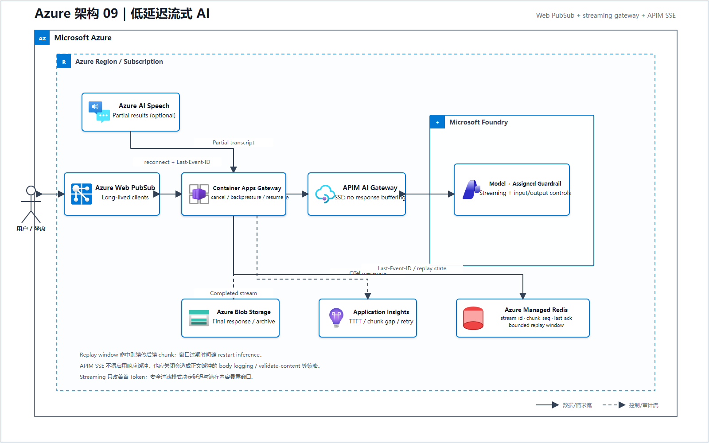
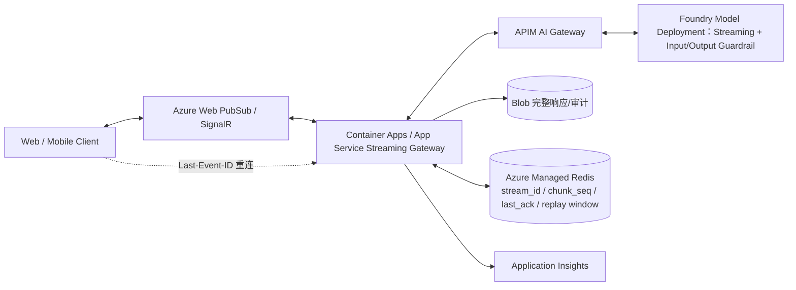
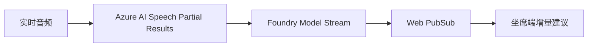

# 09 低延迟流式 AI（Microsoft Foundry）

> AWS 源场景：Bedrock Streaming、API Gateway WebSocket、Lambda Response Streaming、AppSync。

## Azure 架构图

可编辑源图：[09-streaming-ai-azure.svg](diagrams/09-streaming-ai-azure.svg)

## 标准架构

语音场景：

## 服务边界

- Web PubSub/SignalR 负责大量长连接和客户端广播；
- Container Apps/App Service 负责可控的流式代理、取消和背压；Azure Managed Redis 保存有限 replay window，才能实现按 chunk 序号恢复；
- APIM AI Gateway 负责身份、配额、Token 限制、模型/工具治理；
- Foundry Responses/模型 API 负责 SSE/Token streaming；
- Blob 保存完整最终记录，Application Insights 保存运行证据。

APIM 代理 SSE 时必须关闭 `forward-request` 的响应缓冲，并避免会缓冲正文的策略和诊断正文日志；否则“支持 Streaming”的后端也会被网关重新攒成整包。

## 为什么不把所有长连接都放进 Functions

Azure Functions 适合事件驱动计算，但长时间双向连接和精细背压通常由 Web PubSub + Container Apps/App Service 更稳定。Functions 可以处理短时转换、回调和异步 Activity，不必承担每个客户端连接。

## 韧性要求

- 每个 stream 具有 request/conversation ID；
- 客户端记录最后确认 chunk，并通过 `Last-Event-ID` 重连；Gateway 从 Redis 的 `stream_id/chunk_seq` replay window 重放未确认片段，过期后只能重新发起推理；
- 设置首 Token、chunk 间隔和总时长三个超时；
- 取消请求要向下游传播；
- 明确选择 Foundry content streaming/filtering 模式并接受其延迟与暴露窗口；若另加应用级审核，必须先缓冲安全边界再向客户端释放，不能把已发送 chunk 当作还能撤回。

Streaming 改善的是首 Token 和用户感知延迟，不保证总推理时间更短。

## 官方依据

- [Foundry Models/Responses 开发入口](https://learn.microsoft.com/en-us/azure/foundry/how-to/develop/sdk-overview)
- [Azure Web PubSub](https://learn.microsoft.com/en-us/azure/azure-web-pubsub/overview)
- [APIM AI Gateway](https://learn.microsoft.com/en-us/azure/api-management/genai-gateway-capabilities)
- [APIM 的 SSE 配置要求](https://learn.microsoft.com/en-us/azure/api-management/how-to-server-sent-events)
- [Foundry content streaming](https://learn.microsoft.com/en-us/azure/foundry/openai/concepts/content-streaming)

---

## 系列导航

- 上一篇：[08 Serverless 编排与人工审批](./08_Serverless_编排与人工审批.md)
- 下一篇：[10 私有网络、多订阅与数据驻留](./10_私有网络_多账户与数据驻留.md)
