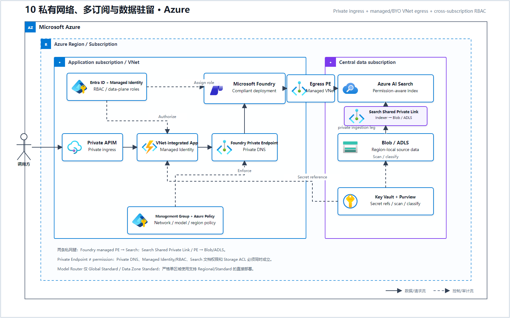
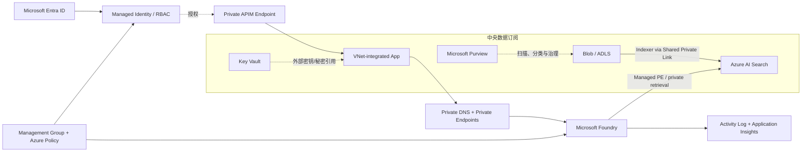

# 10 私有网络、多订阅与数据驻留（Microsoft Foundry）

> AWS 源场景：PrivateLink/VPC Endpoint、IAM/SCP、Lake Formation、CloudTrail。

## Azure 架构图

可编辑源图：[10-private-multi-account-azure.svg](diagrams/10-private-multi-account-azure.svg)

## 四层治理架构

## 四个问题必须分别回答

| 控制问题 | Azure 方案 |
|---|---|
| 流量是否经过公网 | Foundry Managed VNet/BYO VNet、Private Endpoint、Private DNS、APIM 私有入口 |
| 谁能调用哪个模型/Agent | Entra ID、Managed Identity、Azure RBAC、APIM Policy |
| 谁能访问哪些数据 | Storage RBAC/ACL、AI Search 文档权限、Purview 策略、跨订阅角色分配 |
| 数据能否离开地理边界 | 区域/数据区部署、目标区域可用性、禁用不合规 Global 路由、Azure Policy |

## 多账户到多订阅的映射

| AWS | Azure |
|---|---|
| Organizations / OU | Management Group |
| SCP | Azure Policy + RBAC/PIM |
| Account | Subscription |
| StackSets | Bicep/Terraform + Deployment Stacks/Azure DevOps |
| IAM Role | Managed Identity / Service Principal + Azure Role |
| Lake Formation LF-Tag | Storage ACL/RBAC + Purview policy/label；按数据平台补充治理 |
| CloudTrail | Azure Activity Log；各服务数据面审计另行开启 |

## 不变量

- Private Endpoint 只解决网络路径，不自动授予数据权限；
- 跨订阅链路需要同时完成 Private Endpoint、Private DNS 解析、Managed Identity/RBAC 和数据面 ACL；缺一项都不算私有 RAG 可用。
- RAG 至少有两条独立网络腿：Foundry/IQ 到 Search 的检索路径，以及 Search Indexer 到 Blob/ADLS 的数据摄取路径；后者必须使用 Shared Private Link/Private Endpoint、Private DNS 和 Storage 授权，不能只证明 Foundry 到 Search 是私网。
- Foundry Agent 默认可以是公共基线，私有隔离必须显式配置；
- Trace 可能包含 Prompt 和客户数据，Application Insights 也要经过 Private Link Scope、RBAC 和保留策略治理；
- Model Router 当前只支持 Global Standard 与 Data Zone Standard；严格单区域处理要走支持 Regional/Standard 的直接模型部署，不能让 Router 代替区域边界。

## 官方依据

- [Foundry Managed Virtual Network](https://learn.microsoft.com/en-us/azure/foundry/how-to/managed-virtual-network)
- [Foundry Agent Service networking options](https://learn.microsoft.com/en-us/azure/foundry/agents/concepts/networking-options)
- [Baseline Microsoft Foundry chat architecture](https://learn.microsoft.com/en-us/azure/architecture/example-scenario/ai/commerce-chatbot)

---

## 系列导航

- 上一篇：[09 低延迟流式 AI](./09_低延迟流式_AI.md)
- 下一篇：[11 多模态内容摄取流水线](./11_多模态内容摄取流水线.md)
