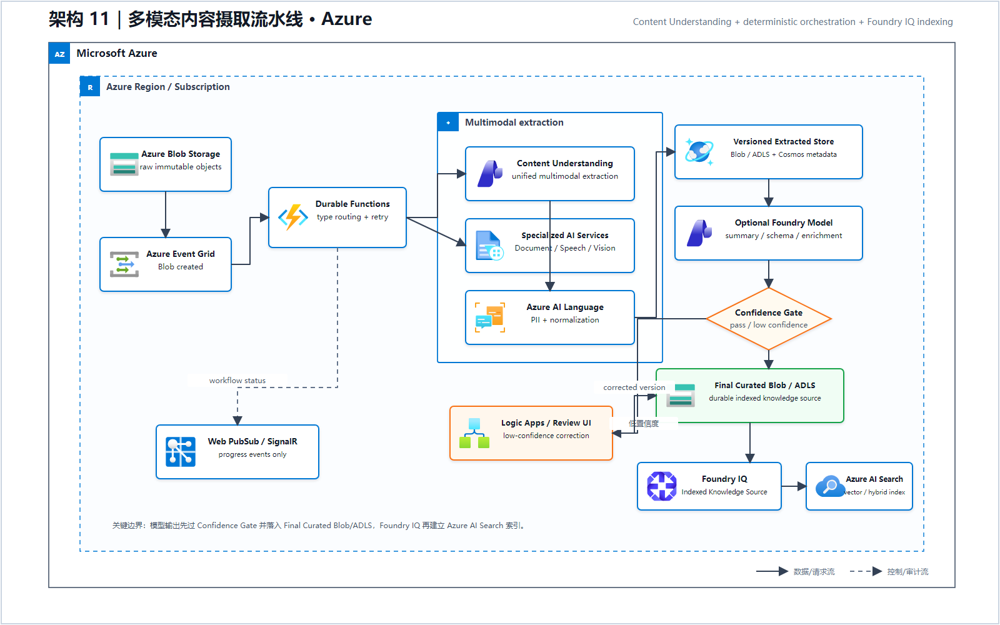
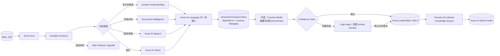

# 11 多模态内容摄取流水线（Microsoft Foundry）

> AWS 源场景：Bedrock Data Automation、Textract、Transcribe、Rekognition、Comprehend。

## Azure 架构图

可编辑源图：[11-multimodal-ingestion-azure.svg](diagrams/11-multimodal-ingestion-azure.svg)

## 标准架构

## 1:1 功能映射

| AWS | Azure |
|---|---|
| S3 Object Created | Blob Event Grid event |
| Step Functions | Durable Functions/Logic Apps |
| Bedrock Data Automation | Azure Content Understanding |
| Textract | Azure AI Document Intelligence |
| Transcribe | Azure AI Speech |
| Rekognition | Azure AI Vision |
| Comprehend PII | Azure AI Language PII |
| A2I | Logic Apps/Power Apps/业务审核台 + 持久化队列 |
| AppSync Subscription | Azure Web PubSub/SignalR |

## 处理原则

- Content Understanding 适合跨文档、图片、视频和音频的统一字段抽取；
- 已有成熟单模态规则时，可以继续使用 Document Intelligence、Speech、Vision；
- Durable Functions 保存确定性编排状态，Blob 只传 URI，避免状态 payload 过大；
- 低置信度结果必须进入人工审核后才能进入自动决策或知识库；
- 原始文件、抽取结果、标准化结果和最终摘要要分别版本化，不能互相覆盖。
- Foundry IQ 是知识源/检索层，不是结果存储；模型输出先经过 Confidence Gate，低置信度走人工修正，通过后写入 Final Curated Blob/ADLS，再由 Indexed Knowledge Source 建立 Azure AI Search 索引。
- Web PubSub 只推送 Durable Functions 的进度事件，Blob Storage 不会直接向客户端广播。

## 官方依据

- [Content Understanding 多模态分类与抽取](https://learn.microsoft.com/azure/ai-services/content-understanding/how-to/classification-content-understanding-studio)
- [Azure AI Document Intelligence](https://learn.microsoft.com/en-us/azure/ai-services/document-intelligence/overview)
- [Azure AI Speech](https://learn.microsoft.com/en-us/azure/ai-services/speech-service/overview)

---

## 系列导航

- 上一篇：[10 私有网络、多订阅与数据驻留](./10_私有网络_多账户与数据驻留.md)
- 下一篇：[12 模型路由、容量与韧性](./12_模型路由_容量与韧性.md)
