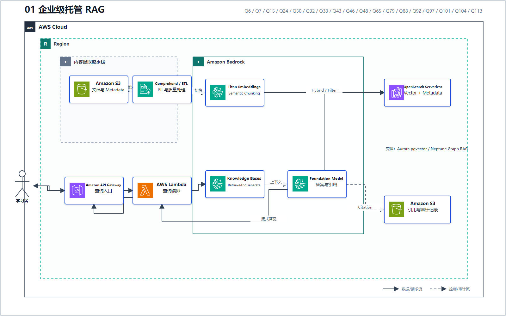
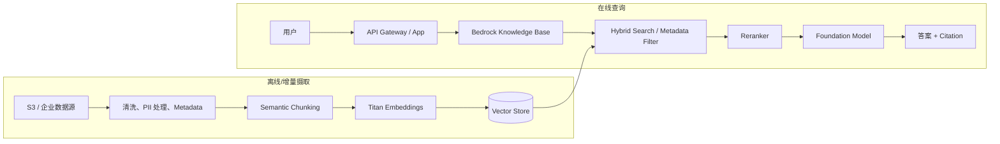

# 01 企业级托管 RAG

> 系列：AWS AIP-C01 117 题经典架构
>
> 分析范围：`AWS_AIP-C01_中文版.md` 的 Q1–Q117；题号与正确方案按本地题库归纳。

## AWS 架构图

可编辑源图：[01-managed-rag.svg](diagrams/01-managed-rag.svg)

## 系列说明

本报告没有按服务频次机械罗列，而是只保留满足以下条件的模式：

1. 在多道题中重复出现；
2. 能形成完整的数据流、请求流或控制流；
3. 换一个业务行业后仍然成立；
4. 能解释题目为什么选某种托管服务，以及为什么排除相似选项。

最终归纳出 **12 套经典架构**。其中 RAG、Guardrails、评估发布、可观测性、编排和私有治理是最高优先级。

## 十二套架构总览

| # | 经典架构 | 代表题号 | 看到什么题干信号 | 核心服务 |
|---|---|---|---|---|
| 1 | [企业级托管 RAG](./01_企业级托管_RAG.md) | Q6、Q7、Q15、Q24、Q30、Q32、Q38、Q43、Q46、Q48、Q65、Q79、Q88、Q92、Q97、Q101、Q104、Q113 | 私有文档、语义检索、引用、减少幻觉、Metadata、混合搜索 | Bedrock Knowledge Bases、OpenSearch Serverless、Titan Embeddings、S3 |
| 2 | [Agentic RAG 与多 Agent](./02_Agentic_RAG_与多_Agent.md) | Q16、Q26、Q53、Q56、Q62、Q112 | 不只回答，还要查资料、调用 API、保留会话、按领域分工 | Bedrock Agents、AgentCore、Knowledge Bases、Action Groups、Lambda |
| 3 | [安全 Text-to-SQL](./03_安全_Text-to-SQL.md) | Q90、Q105 | 自然语言查询 RDS、必须验证 SQL/Schema、执行前审计 | Bedrock、Guardrails、Lambda SQL Parser、RDS Data API |
| 4 | [Guardrails 纵深防御](./04_Guardrails_纵深防御.md) | Q2、Q5、Q11、Q14、Q18、Q21、Q36、Q55、Q61、Q77、Q81、Q91、Q94、Q117 | Prompt Injection、PII、禁用主题、事实依据、每次推理强制安全策略 | Bedrock Guardrails、IAM Condition、CloudWatch、SQS/A2I |
| 5 | [Prompt 与运行时配置生命周期](./05_Prompt_与运行时配置生命周期.md) | Q4、Q5、Q9、Q11、Q49、Q59、Q80、Q84、Q103、Q110、Q111 | Prompt 版本、参数化、审批、无需重新部署切模型、Feature Flag | Prompt Management、AWS AppConfig Agent、CloudTrail、IAM |
| 6 | [评估驱动的发布门禁](./06_评估驱动的发布门禁.md) | Q1、Q12、Q29、Q34、Q55、Q69、Q79、Q86、Q98、Q107、Q108、Q115 | 比较模型/Prompt、幻觉率、语义漂移、质量不达标禁止部署 | Bedrock Evaluation、LLM-as-a-Judge、S3、CodePipeline、A2I |
| 7 | [GenAI 可观测性与成本监控](./07_GenAI_可观测性与成本监控.md) | Q18、Q25、Q31、Q66、Q70、Q74、Q76、Q95、Q100、Q112 | Token 异常、质量漂移、延迟、Tool 失败、业务指标关联 | Invocation Logging、CloudWatch、X-Ray、CloudTrail、SNS |
| 8 | [Serverless 编排与人工审批](./08_Serverless_编排与人工审批.md) | Q20、Q22、Q27、Q35、Q40、Q44、Q48、Q53、Q54、Q90、Q93、Q111、Q114、Q117 | 多步骤、并行、重试、回调、长时间人工审批、大对象传递 | Step Functions、Lambda、EventBridge、SQS、S3、DynamoDB |
| 9 | [低延迟流式 AI](./09_低延迟流式_AI.md) | Q3、Q10、Q39、Q60、Q82、Q88、Q102、Q109、Q117 | 首 Token 延迟、逐步显示、双向流、长响应、部分响应 | Bedrock Streaming API、API Gateway WebSocket、Lambda Streaming、AppSync |
| 10 | [私有网络、多账户与数据驻留](./10_私有网络_多账户与数据驻留.md) | Q8、Q13、Q36、Q58、Q71、Q72、Q77、Q81、Q85、Q87、Q91、Q96、Q100、Q104 | 私网、跨账户、部门隔离、只允许指定模型、数据不得离开区域 | PrivateLink/VPC Endpoint、IAM、SCP、Lake Formation、CloudTrail |
| 11 | [多模态内容摄取流水线](./11_多模态内容摄取流水线.md) | Q36、Q39、Q40、Q80、Q93、Q106、Q114 | PDF/扫描件/音频/图片/视频，抽取后再生成或检索 | BDA、Textract、Transcribe、Rekognition、Comprehend、S3 |
| 12 | [模型路由、容量与韧性](./12_模型路由_容量与韧性.md) | Q4、Q22、Q23、Q33、Q42、Q50、Q59、Q67、Q71、Q74、Q76、Q84、Q102、Q103、Q114、Q116 | 动态切模型、突发流量、稳定吞吐、低置信度升级、自动回滚 | AppConfig、Provisioned Throughput、CRI、SQS、Fargate、Step Functions |

---

## 标准架构

## 为什么它经典

这是 117 题中最稳定、覆盖面最广的架构。它把“模型知道什么”从 Prompt 中剥离出来，变成可更新、可过滤、可引用的检索层。

典型能力由不同题目逐步补齐：

- **基础托管 RAG**：Q15、Q38；
- **大规模向量与 Metadata 过滤**：Q6、Q46；
- **精确术语 + 语义相似度**：Q7、Q65 的 Hybrid Search；
- **语义切块**：Q30、Q32、Q43、Q101；
- **来源引用与审计**：Q24、Q38、Q62；
- **Reranking**：Q65、Q88；
- **复杂问题拆解**：Q97 的 Query Decomposition；
- **摄取前 PII 处理**：Q48；
- **大上下文按需检索**：Q113。

## 向量存储怎么选

| 场景 | 题库中的优先方案 | 对应题号 | 判断理由 |
|---|---|---|---|
| 千万级向量、低运维、Metadata 过滤 | OpenSearch Serverless | Q6 | 托管向量搜索与过滤能力完整 |
| 已有 OpenSearch，还要精确术语与语义检索 | OpenSearch Hybrid Search | Q7、Q65 | Keyword + Vector，再配 Reranker |
| 关系型数据与向量放在一起、规模小于百万 | Aurora PostgreSQL Serverless + pgvector | Q92 | 保留 SQL/关系模型，同时支持相似度搜索 |
| 多跳实体关系就是问题核心 | Neptune Analytics + Graph RAG | Q17 | 重点是“谁与谁如何连接”，不是普通文档相似度 |
| 低运维的普通文档问答 | Bedrock Knowledge Bases 管理检索 | Q15、Q38 | 不必自行拼接全部检索组件 |

## 常见误判

- 看到“企业搜索”就选 Kendra：在本题库相关题中，它常被放在需要 Bedrock Knowledge Bases、OpenSearch 或更低运维 RAG 的场景里，不能仅凭服务名选择。
- 看到 S3 数据就选 Athena：Athena 适合批量 SQL 分析，不等于低延迟语义检索。
- 只加 Guardrails 解决幻觉：Guardrails 能检查或阻止部分内容，但“答案必须基于内部资料并给引用”首先是 RAG 问题。
- 所有场景都选 OpenSearch：Q92 表明小规模、关系型数据共存时，Aurora PostgreSQL Serverless + pgvector 更自然；Q17 的多跳关系应转向 Graph RAG。

---

## 系列导航

- 系列总览：[01 企业级托管 RAG](./01_企业级托管_RAG.md)
- 下一篇：[02 Agentic RAG 与多 Agent](./02_Agentic_RAG_与多_Agent.md)
