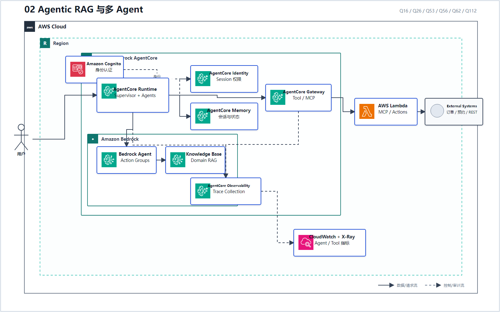
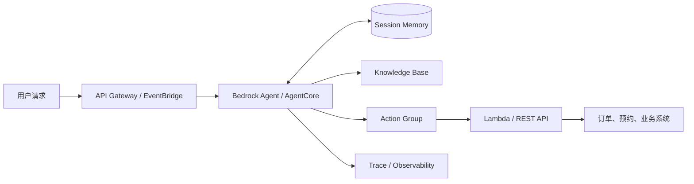
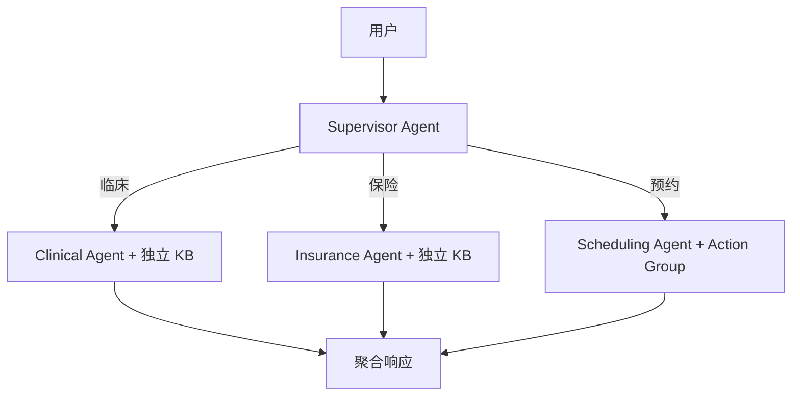

# 02 Agentic RAG 与多 Agent

> 系列：AWS AIP-C01 117 题经典架构
>
> 分析范围：`AWS_AIP-C01_中文版.md` 的 Q1–Q117；题号与正确方案按本地题库归纳。

## AWS 架构图

可编辑源图：[02-agentic-rag.svg](diagrams/02-agentic-rag.svg)

## 标准架构

当领域很多时，再增加 Supervisor：

## 题库组合出的职责边界

- Q16：AgentCore 管理 Memory、Identity、事件和同步调用；
- Q26：Knowledge Base 负责“查资料”，Action Group 负责“做事情”，Trace 负责审计；
- Q53：多个 Agent 有严格顺序、重试和失败分支时，用 Step Functions 显式编排；
- Q56：按领域拆分独立 Knowledge Base，由 Supervisor 做意图路由；
- Q62：Agent Trace + 引用 + Serverless API 层；
- Q112：AgentCore Observability + X-Ray 跟踪自定义 Tool。

## 关键决策

| 需求 | 选型 |
|---|---|
| 只需根据文档回答 | Knowledge Base/RAG，不必上 Agent |
| 需要调用订单、退款、预约等业务 API | Agent + Action Group |
| 跨轮会话和身份上下文 | AgentCore Memory/Identity |
| 多领域且数据必须隔离 | Supervisor + Domain Agent + 独立 KB |
| 工作步骤必须确定、可重试、可审计 | Step Functions 编排 Agent，而不是完全交给模型自由规划 |

---

## 系列导航

- 上一篇：[01 企业级托管 RAG](./01_企业级托管_RAG.md)
- 系列总览：[01 企业级托管 RAG](./01_企业级托管_RAG.md)
- 下一篇：[03 安全 Text-to-SQL](./03_安全_Text-to-SQL.md)
