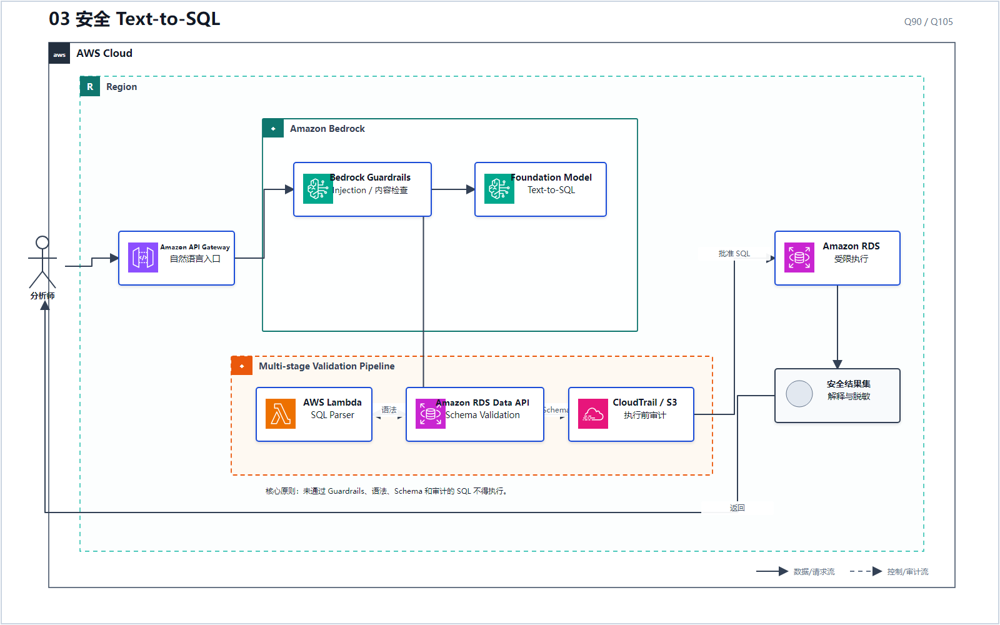
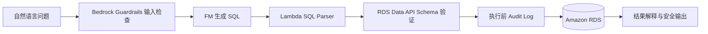

# 03 安全 Text-to-SQL

> 系列：AWS AIP-C01 117 题经典架构
>
> 分析范围：`AWS_AIP-C01_中文版.md` 的 Q1–Q117；题号与正确方案按本地题库归纳。

## AWS 架构图

可编辑源图：[03-secure-text-to-sql.svg](diagrams/03-secure-text-to-sql.svg)

## 标准架构

## 代表题目

- **Q90**：结构化预订、偏好和忠诚度数据在 RDS 中，正确思路是 Text-to-SQL + SQL Validation，再由 Step Functions/Lambda 编排；
- **Q105**：把安全链条补全为 Guardrails → SQL Parser → RDS Data API Schema Validation → 执行前审计。

## 与 RAG 的分界

| 问题本质 | 正确方向 |
|---|---|
| “从文档中找最相关段落并生成回答” | RAG / 向量检索 |
| “把自然语言变成受约束的关系型查询” | Text-to-SQL |
| “实体之间存在多跳关系” | Graph RAG / Neptune |
| “S3 上已有固定 SQL 报表分析” | Athena 类批处理查询，不是实时 Text-to-SQL 安全链 |

核心不是“模型能生成 SQL”，而是 **未经语法、Schema、权限和审计验证的 SQL 不能执行**。

---

## 系列导航

- 上一篇：[02 Agentic RAG 与多 Agent](./02_Agentic_RAG_与多_Agent.md)
- 系列总览：[01 企业级托管 RAG](./01_企业级托管_RAG.md)
- 下一篇：[04 Guardrails 纵深防御](./04_Guardrails_纵深防御.md)
