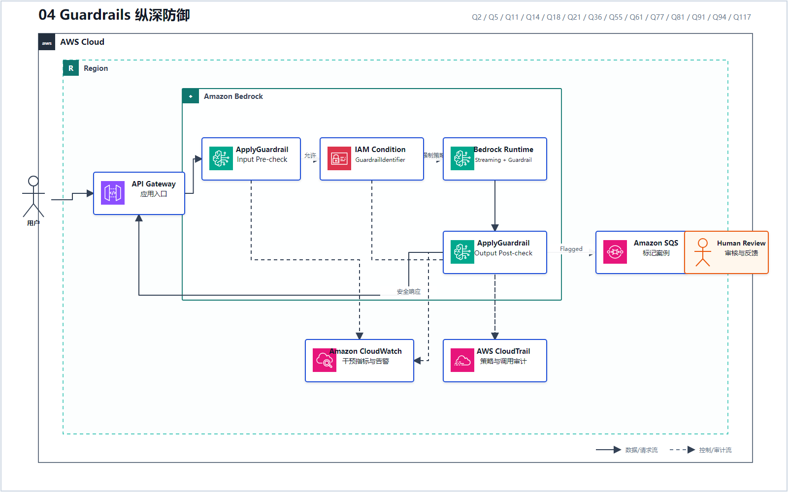
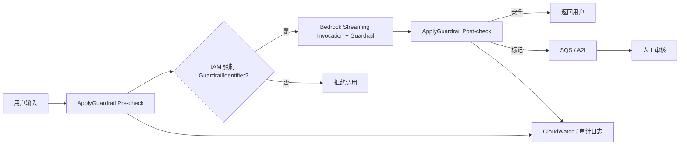

# 04 Guardrails 纵深防御

> 系列：AWS AIP-C01 117 题经典架构
>
> 分析范围：`AWS_AIP-C01_中文版.md` 的 Q1–Q117；题号与正确方案按本地题库归纳。

## AWS 架构图

可编辑源图：[04-guardrails-defense.svg](diagrams/04-guardrails-defense.svg)

## 完整控制链

Q117 最接近这套完整架构；Q77、Q81 则补上 IAM/SCP 的强制执行，避免调用方绕过 Guardrail。

## 策略与题干信号

| 题干要求 | Guardrails 能力 | 代表题号 |
|---|---|---|
| 禁止投资建议等业务主题 | Denied Topics | Q2、Q14、Q61 |
| 竞争对手名称、特定词语 | Word Filters | Q2 |
| PII 屏蔽或阻止 | Sensitive Information Filter | Q14、Q61、Q91、Q94 |
| Prompt Injection | Prompt Attack/Content Filter | Q21、Q105 |
| 回答必须有依据 | Contextual Grounding Check | Q2、Q18 |
| 只检测、不阻止 | Detect 模式 | Q11 |
| 所有账户、每次调用都必须应用 | SCP/IAM `GuardrailIdentifier` 条件 | Q77、Q81、Q117 |

## Guardrails 不能替代什么

- 不能替代 Knowledge Base 提供权威资料；
- 不能替代 SQL Parser 和 Schema Validation；
- 不能替代 CloudTrail/CloudWatch 的审计与告警；
- 不能替代高风险决策中的人工审批。

---

## 系列导航

- 上一篇：[03 安全 Text-to-SQL](./03_安全_Text-to-SQL.md)
- 系列总览：[01 企业级托管 RAG](./01_企业级托管_RAG.md)
- 下一篇：[05 Prompt 与运行时配置生命周期](./05_Prompt_与运行时配置生命周期.md)
