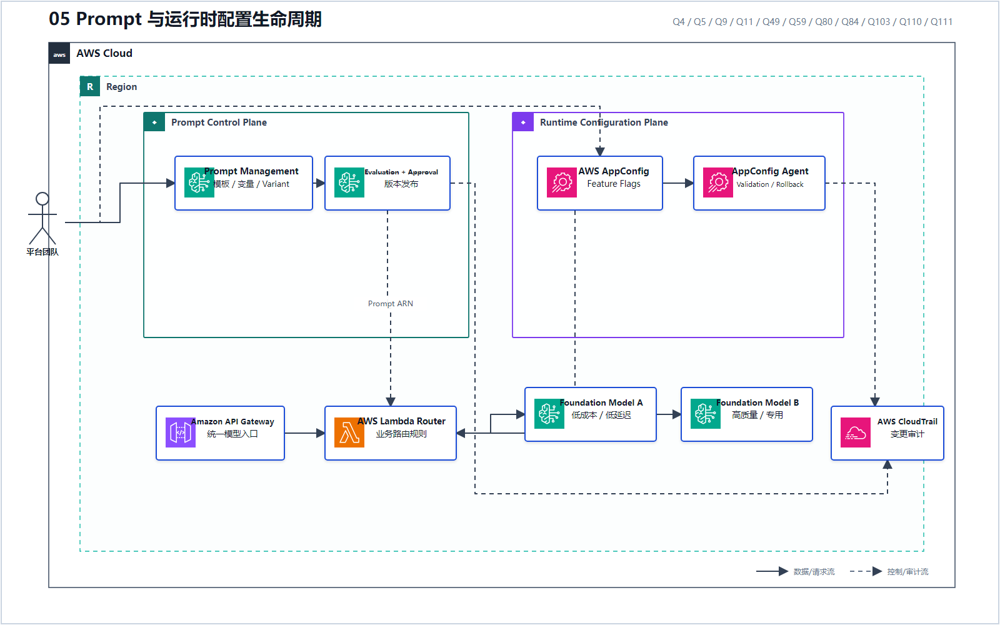
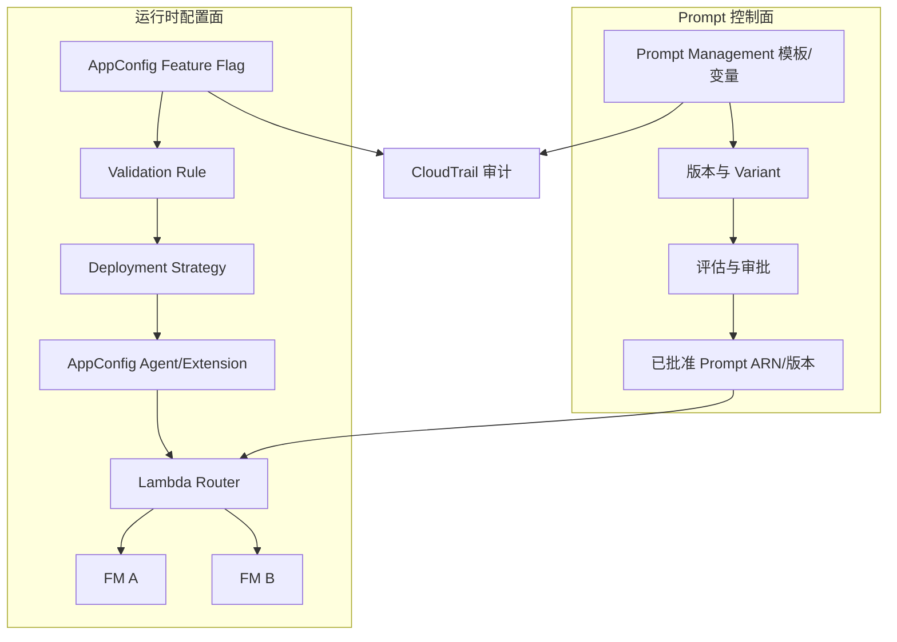

# 05 Prompt 与运行时配置生命周期

> 系列：AWS AIP-C01 117 题经典架构
>
> 分析范围：`AWS_AIP-C01_中文版.md` 的 Q1–Q117；题号与正确方案按本地题库归纳。

## AWS 架构图

可编辑源图：[05-prompt-config-lifecycle.svg](diagrams/05-prompt-config-lifecycle.svg)

## 两条控制线

## 三个服务不要混淆

| 需求 | 应选能力 | 代表题号 |
|---|---|---|
| Prompt 模板、变量、版本、Variant | Bedrock Prompt Management | Q5、Q9、Q11、Q84、Q110 |
| 无需重新部署代码就切模型/参数 | AWS AppConfig + Agent/Extension | Q4、Q49、Q59、Q103 |
| 多步骤调用、分支、重试、回滚流程 | Step Functions | Q22、Q53、Q111 |

Q103 是运行时配置发布的经典完整题：Feature Flag + Validation Rule + Lambda Extension + Linear Deployment Strategy + 自动回滚。

---

## 系列导航

- 上一篇：[04 Guardrails 纵深防御](./04_Guardrails_纵深防御.md)
- 系列总览：[01 企业级托管 RAG](./01_企业级托管_RAG.md)
- 下一篇：[06 评估驱动的发布门禁](./06_评估驱动的发布门禁.md)
