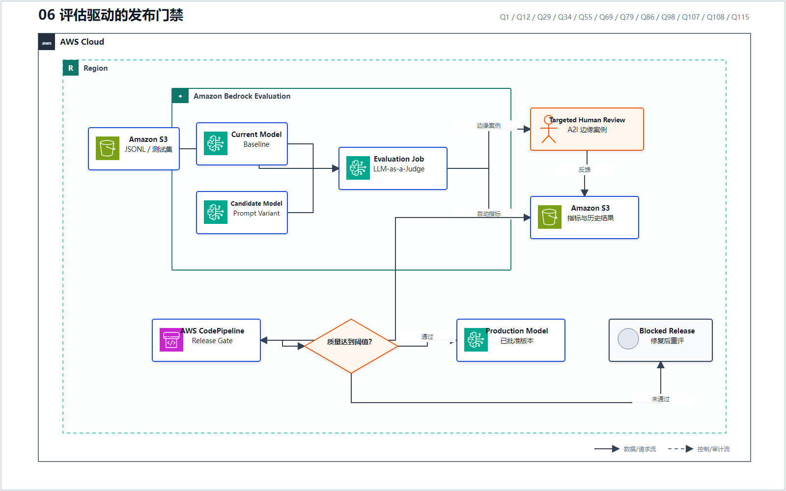
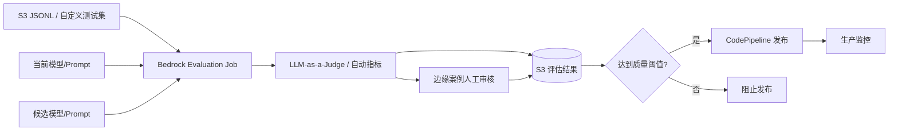

# 06 评估驱动的发布门禁

> 系列：AWS AIP-C01 117 题经典架构
>
> 分析范围：`AWS_AIP-C01_中文版.md` 的 Q1–Q117；题号与正确方案按本地题库归纳。

## AWS 架构图

可编辑源图：[06-evaluation-release-gate.svg](diagrams/06-evaluation-release-gate.svg)

## 标准架构

## 题库中的指标层次

| 评估目标 | 指标/方法 | 代表题号 |
|---|---|---|
| 公平性偏差 | SageMaker Clarify + CloudWatch | Q1 |
| 检索质量与幻觉 | Precision、Hallucination、LLM-as-a-Judge | Q12、Q79 |
| 文本生成/摘要 | RWK、BERT Score | Q34 |
| 金融合规与关键案例 | Judge Model + Guardrails + A2I | Q55 |
| 多语言一致性 | Similarity + Hallucination Threshold | Q69 |
| Prompt 变更门禁 | Evaluation Job + CodePipeline | Q98 |
| 快速 PoC 模型比较 | 小型匿名数据集 + Judge Model | Q107 |
| 多模型质量/安全报告 | S3 JSONL + 每个 FM 独立 Evaluation Job | Q108 |
| 升级后的语义漂移 | Semantic Similarity + S3 历史结果 | Q115 |

经典原则是：**先固定评估数据和阈值，再谈模型升级；离线通过后，线上继续监控。**

---

## 系列导航

- 上一篇：[05 Prompt 与运行时配置生命周期](./05_Prompt_与运行时配置生命周期.md)
- 系列总览：[01 企业级托管 RAG](./01_企业级托管_RAG.md)
- 下一篇：[07 GenAI 可观测性与成本监控](./07_GenAI_可观测性与成本监控.md)
