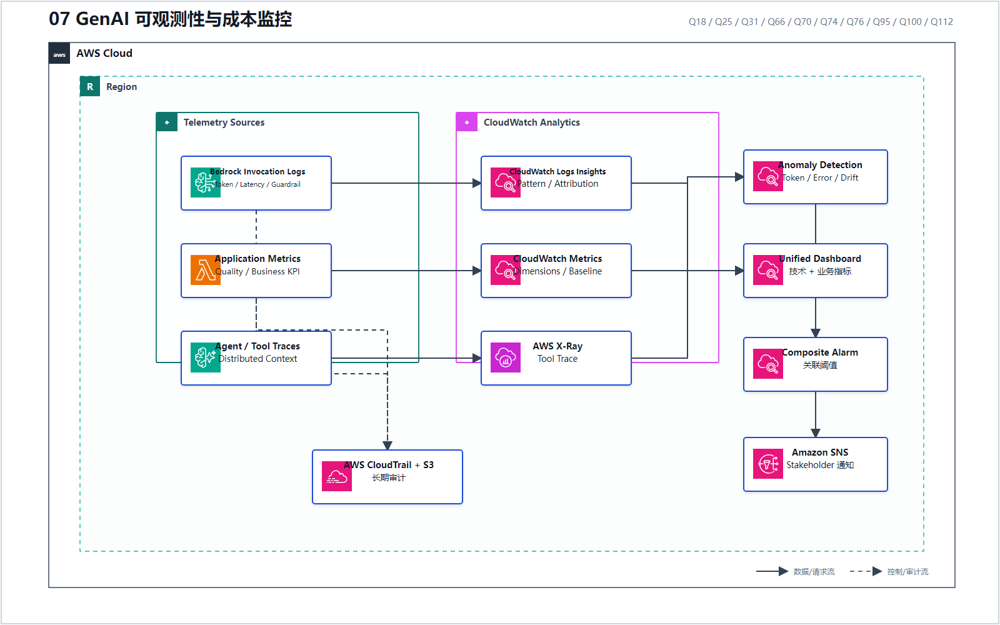
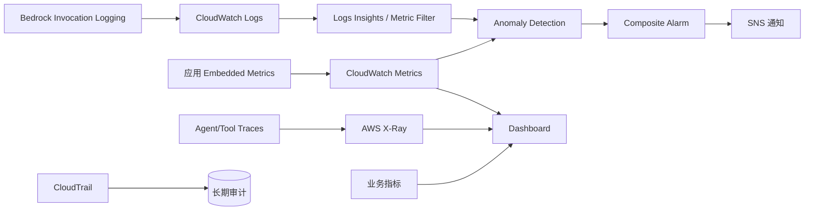

# 07 GenAI 可观测性与成本监控

> 系列：AWS AIP-C01 117 题经典架构
>
> 分析范围：`AWS_AIP-C01_中文版.md` 的 Q1–Q117；题号与正确方案按本地题库归纳。

## AWS 架构图

可编辑源图：[07-genai-observability.svg](diagrams/07-genai-observability.svg)

## 三层指标架构

## 必须同时观察三类信号

1. **平台指标**：Latency、Error、Throttling、Invocation；
2. **模型指标**：Input/Output Token、Grounding、Hallucination、Tool 调用；
3. **业务指标**：转化率、收入影响、推荐质量、部门成本。

题库中的组合证据：

- Q18：Invocation Log + Contextual Grounding + Token Anomaly Detection；
- Q31：Embedded Metric Format + Dimension + Anomaly Detection；
- Q66：Logs Insights 分析 Token，并在 Dashboard 统一呈现；
- Q70：Metric Filter 按 Tool 提取模式，再做自适应异常检测；
- Q76：SDK Retry/Jitter 与 X-Ray Trace 联合排障；
- Q95：技术指标与业务指标进入同一 Dashboard，再用 Composite Alarm + SNS；
- Q112：AgentCore Trace + X-Ray + CloudWatch Dashboard。

不要把 QuickSight、Managed Grafana 仅作为“看起来会画图”的答案。题目要求原生实时告警、日志模式或异常检测时，控制面通常仍在 CloudWatch。

---

## 系列导航

- 上一篇：[06 评估驱动的发布门禁](./06_评估驱动的发布门禁.md)
- 系列总览：[01 企业级托管 RAG](./01_企业级托管_RAG.md)
- 下一篇：[08 Serverless 编排与人工审批](./08_Serverless_编排与人工审批.md)
