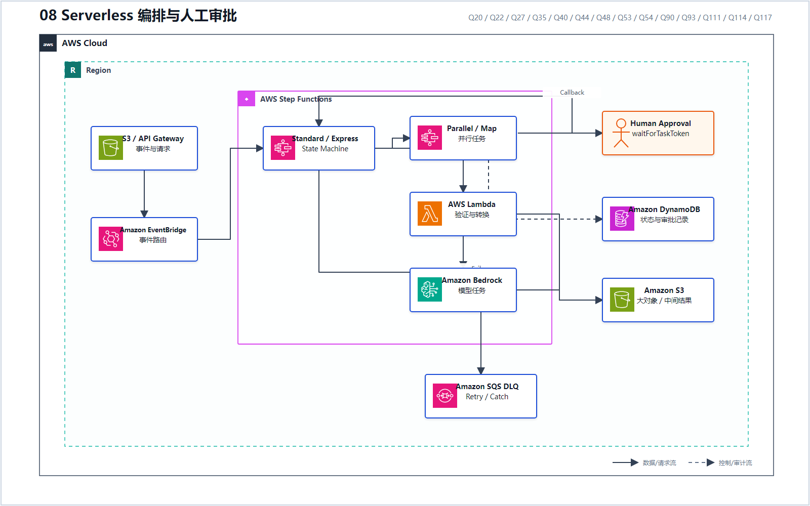
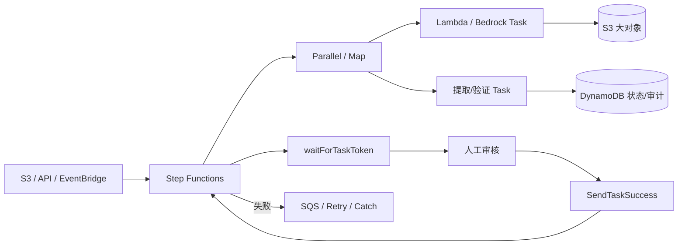

# 08 Serverless 编排与人工审批

> 系列：AWS AIP-C01 117 题经典架构
>
> 分析范围：`AWS_AIP-C01_中文版.md` 的 Q1–Q117；题号与正确方案按本地题库归纳。

## AWS 架构图

可编辑源图：[08-serverless-orchestration.svg](diagrams/08-serverless-orchestration.svg)

## 标准架构

## 经典模式

| 模式 | 代表题号 | 设计重点 |
|---|---|---|
| 并行分析 | Q20 | `Parallel` 同时执行独立分析，缩短总时长 |
| 金丝雀发布控制器 | Q22 | 分阶段迁移流量，读 CloudWatch 指标，自动回滚 |
| 大对象传递 | Q27 | 中间结果放 S3，状态机只传 URI |
| 人工回调 | Q35、Q44 | Standard Workflow + Task Token + DynamoDB 审计 |
| 多 Agent 确定性编排 | Q53 | 每个 Agent/计算步骤都有 Retry 和 Catch |
| 短时高吞吐数据处理 | Q54 | Express Workflow + 服务集成减少自定义 Lambda |
| 事件驱动音频处理 | Q93 | S3 EventBridge 事件启动 Transcribe → Bedrock 流程 |
| 并行 Agent Workflow | Q111 | Map State 并行，显式传递 Metadata |
| 安全前检/后检与人工升级 | Q117 | Guardrail Pre/Post Check + SQS 审核 |

## Standard 与 Express 的判断

- 有人工等待、回调、长时间状态和强审计要求：优先 **Standard**；
- 短时、高频、可快速完成的数据流水线：考虑 **Express**；
- Payload 很大：存 S3，只在状态之间传引用；
- 非确定性的 Agent 决策不能替代 Retry、Catch、Timeout 和审批状态。

---

## 系列导航

- 上一篇：[07 GenAI 可观测性与成本监控](./07_GenAI_可观测性与成本监控.md)
- 系列总览：[01 企业级托管 RAG](./01_企业级托管_RAG.md)
- 下一篇：[09 低延迟流式 AI](./09_低延迟流式_AI.md)
