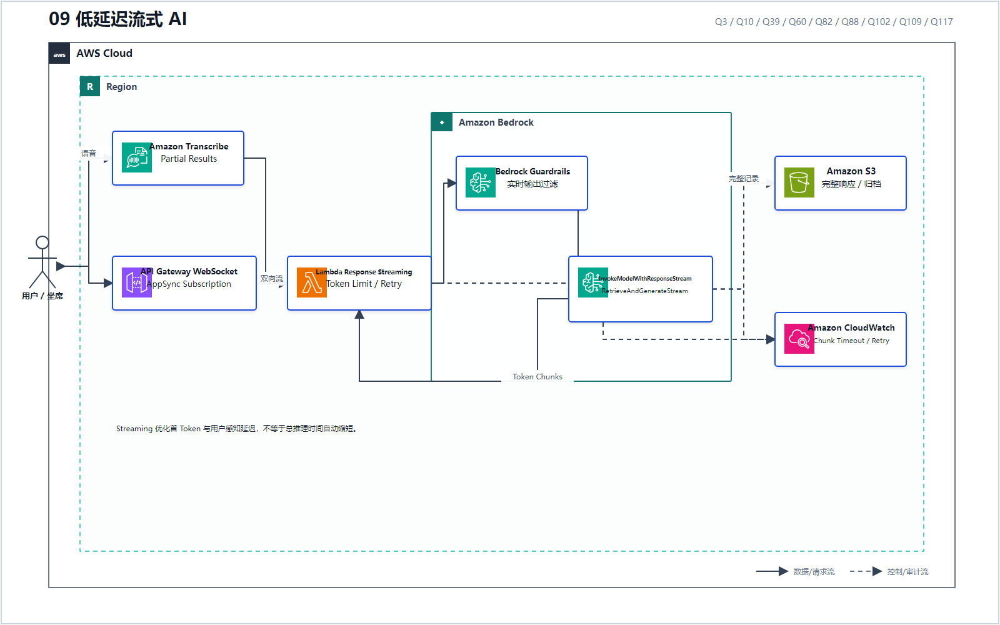
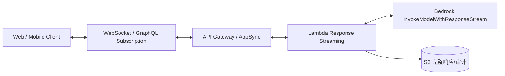
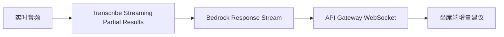

# 09 低延迟流式 AI

> 系列：AWS AIP-C01 117 题经典架构
>
> 分析范围：`AWS_AIP-C01_中文版.md` 的 Q1–Q117；题号与正确方案按本地题库归纳。

## AWS 架构图

可编辑源图：[09-streaming-ai.svg](diagrams/09-streaming-ai.svg)

## 标准架构

语音场景在最前面增加：

## 代表题目

- Q3：Amplify AI Kit + AppSync 支持流式 GraphQL 响应；
- Q10：API Gateway WebSocket + `InvokeModelWithResponseStream`；
- Q39：Transcribe Partial Results → Bedrock Stream → WebSocket；
- Q60：流式连接还要有 Jitter、Circuit Breaker、Chunk 恢复；
- Q82：Lambda Response Streaming + Token Limit；
- Q88：RAG 使用 `RetrieveAndGenerateStream`，并在检索端 Rerank；
- Q102：容器预加载、Dynamic Batching、最小实例数和 Streaming；
- Q109：先返回部分结果，完整记录落 S3 长期保留；
- Q117：流式输出仍必须附加 Guardrail。

关键点：Streaming 改善的是 **首 Token 和用户感知延迟**，不代表总推理时间自动缩短。

---

## 系列导航

- 上一篇：[08 Serverless 编排与人工审批](./08_Serverless_编排与人工审批.md)
- 系列总览：[01 企业级托管 RAG](./01_企业级托管_RAG.md)
- 下一篇：[10 私有网络、多账户与数据驻留](./10_私有网络_多账户与数据驻留.md)
