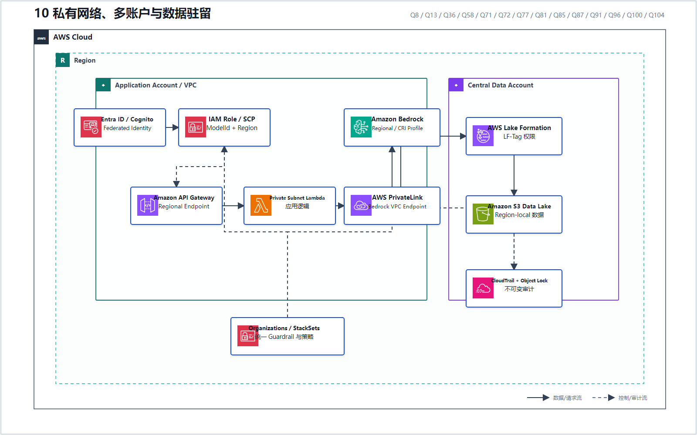
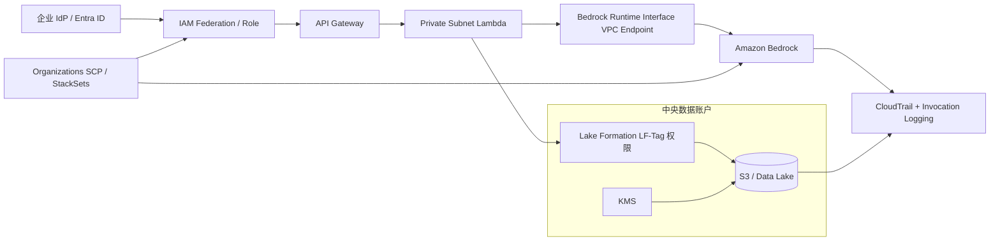

# 10 私有网络、多账户与数据驻留

> 系列：AWS AIP-C01 117 题经典架构
>
> 分析范围：`AWS_AIP-C01_中文版.md` 的 Q1–Q117；题号与正确方案按本地题库归纳。

## AWS 架构图

可编辑源图：[10-private-multi-account.svg](diagrams/10-private-multi-account.svg)

## 四层治理架构

## 四个问题要分别回答

| 控制问题 | 题库方案 | 代表题号 |
|---|---|---|
| 流量是否经过公网 | Interface VPC Endpoint / PrivateLink | Q8、Q77、Q96、Q100 |
| 谁能调用哪个模型 | IAM Role、`ModelId` Condition、SCP | Q13、Q77、Q81、Q100 |
| 谁能访问哪些数据 | Lake Formation LF-Tag、跨账户授权 | Q8、Q87 |
| 数据能否离开地理边界 | Region-local 数据、Geographic CRI Profile、区域 Guardrail | Q13、Q71、Q72、Q85、Q91、Q96 |

补充模式：

- Q58：每个租户/酒店独立账户与 Knowledge Base，形成强隔离；
- Q81：CloudFormation StackSets 在组织内统一部署 Guardrail；
- Q85：Region-specific S3 Policy + Object Lock + Macie + immutable audit；
- Q104：OpenSearch Serverless 还要同时配置调用角色权限和 Data Access Policy。

“VPC Endpoint”只解决网络路径，不会自动解决模型授权、数据权限、区域合规和审计，四层缺一不可。

---

## 系列导航

- 上一篇：[09 低延迟流式 AI](./09_低延迟流式_AI.md)
- 系列总览：[01 企业级托管 RAG](./01_企业级托管_RAG.md)
- 下一篇：[11 多模态内容摄取流水线](./11_多模态内容摄取流水线.md)
