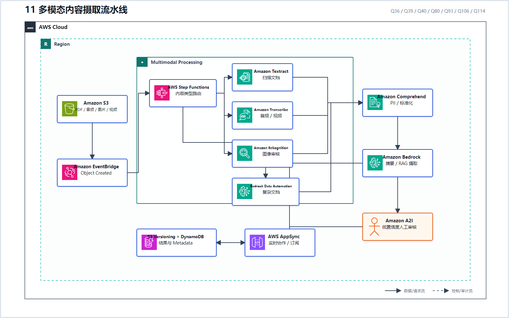
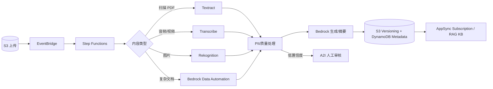

# 11 多模态内容摄取流水线

> 系列：AWS AIP-C01 117 题经典架构
>
> 分析范围：`AWS_AIP-C01_中文版.md` 的 Q1–Q117；题号与正确方案按本地题库归纳。

## AWS 架构图

可编辑源图：[11-multimodal-ingestion.svg](diagrams/11-multimodal-ingestion.svg)

## 标准架构

## 题目如何拼成完整架构

- Q36：Textract 抽取扫描件，低置信度送 A2I，推理前处理 PII；
- Q39：实时语音用 Transcribe Streaming，而不是等待完整文件；
- Q40：文本 PII 用 Comprehend，图片审核用 Rekognition，再由 Step Functions 编排；
- Q80：多模态数据预处理后，将摘要摄取到 RAG Knowledge Base；
- Q93：S3 Object Created → EventBridge → Step Functions → Transcribe → Bedrock；
- Q106：BDA + Textract + Transcribe，结果进入带版本的 S3、DynamoDB Metadata 和 AppSync 实时协作；
- Q114：简单文件扩展名路由放应用代码，复杂内容语义路由放 Step Functions。

经典原则：**先把不同模态转换成可治理的结构化/文本中间层，再调用 FM；低置信度结果不要直接进入自动决策。**

---

## 系列导航

- 上一篇：[10 私有网络、多账户与数据驻留](./10_私有网络_多账户与数据驻留.md)
- 系列总览：[01 企业级托管 RAG](./01_企业级托管_RAG.md)
- 下一篇：[12 模型路由、容量与韧性](./12_模型路由_容量与韧性.md)
