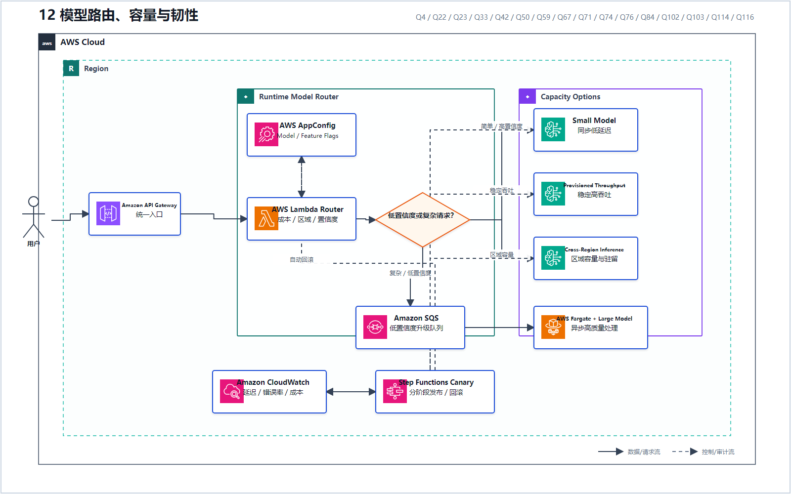
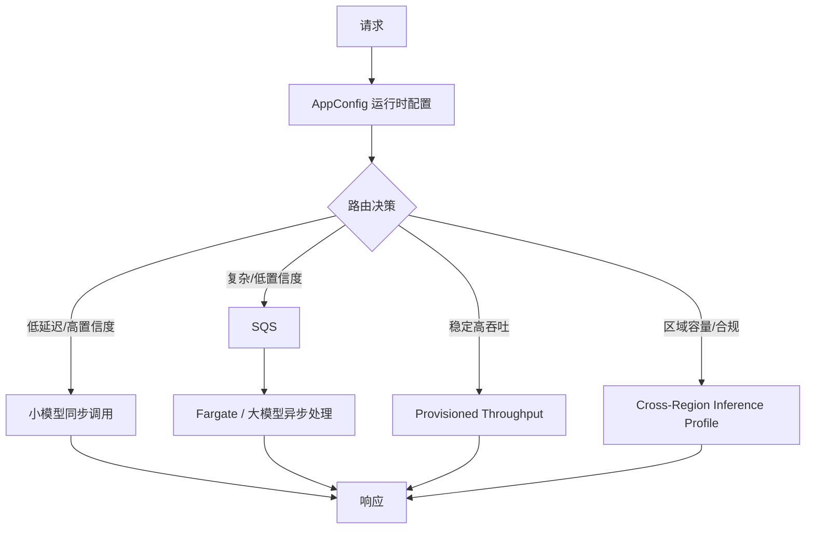
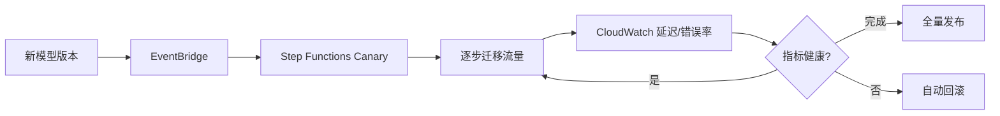
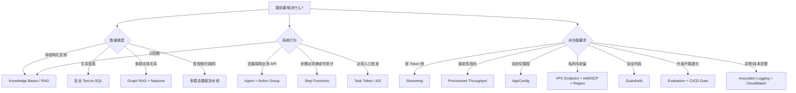

# 12 模型路由、容量与韧性

> 系列：AWS AIP-C01 117 题经典架构
>
> 分析范围：`AWS_AIP-C01_中文版.md` 的 Q1–Q117；题号与正确方案按本地题库归纳。

## AWS 架构图

可编辑源图：[12-model-routing-resilience.svg](diagrams/12-model-routing-resilience.svg)

## 运行时路由与降级

## 自动发布与回滚

## 题库中的容量决策

| 信号 | 方案 | 代表题号 |
|---|---|---|
| 无需部署代码切模型 | AppConfig Agent/Extension | Q4、Q49、Q59、Q103 |
| 稳定、可预测的高吞吐 | Provisioned Throughput | Q23、Q33、Q67、Q84 |
| 重复 Prompt/上下文很多 | Prompt Caching + Latency Optimized | Q42 |
| 全球流量与区域容量 | Cross-Region Inference Profile | Q50、Q71、Q74 |
| 暂时性错误和级联失败 | SDK Standard Retry + Jitter + Circuit Breaker | Q60、Q76 |
| 模型升级需自动回滚 | Step Functions Canary + CloudWatch | Q22 |
| 小模型先判断，低置信度升级大模型 | SQS 解耦 + Fargate 异步 | Q116 |
| 简单路由与复杂语义路由并存 | 应用代码 + Step Functions Hybrid Routing | Q114 |

Q116 是成本优化的经典结构：不是所有请求都调用昂贵大模型，而是由小模型先筛选，仅把低置信度请求放入第二阶段异步队列。

---

## 全局选型速查图

## 建议学习顺序

1. 企业级 RAG：先掌握检索、切块、Embedding、向量存储、引用；
2. Guardrails：理解输入、输出、IAM 强制和人工升级；
3. Step Functions：掌握 Parallel、Map、Retry/Catch、Task Token、S3 大对象；
4. Prompt Management + AppConfig：分清 Prompt 资产和运行时配置；
5. Evaluation + CI/CD：形成“测试集—指标—门禁—发布”的闭环；
6. CloudWatch/X-Ray/CloudTrail：形成运行、模型、业务、审计四类证据；
7. Agentic RAG：在普通 RAG 之上增加 Memory、Tool 和多 Agent；
8. Streaming、多模态、Text-to-SQL：按专项补齐；
9. 私网、多账户、数据驻留和模型容量：最后把生产级约束叠加上去。

## 最终记忆框架

不要把 117 道题记成 117 个孤立答案。可以压缩成以下六问：

1. **数据在哪里，是什么形态？** 文档、关系表、图、音视频；
2. **系统是回答问题，还是要执行动作？** RAG 还是 Agent；
3. **输入、输出和执行前分别如何验证？** Guardrails、Parser、Schema、人工；
4. **流程是实时、流式、异步，还是需要回调？** WebSocket、SQS、Step Functions；
5. **怎样证明新模型/Prompt 可以上线？** Evaluation、指标、CI/CD Gate；
6. **怎样证明生产系统安全、稳定、合规？** IAM/VPC/SCP、CloudWatch/X-Ray、CloudTrail、区域驻留。

只要先回答这六问，大多数长题干都能快速还原到本报告中的某一套经典架构。

---

## 系列导航

- 上一篇：[11 多模态内容摄取流水线](./11_多模态内容摄取流水线.md)
- 系列总览：[01 企业级托管 RAG](./01_企业级托管_RAG.md)
