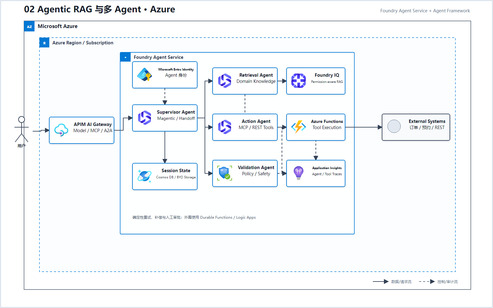
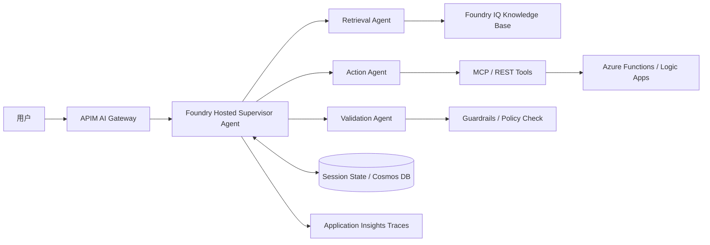

# 02 Agentic RAG 与多 Agent（Microsoft Foundry）

> AWS 源场景：Bedrock Agents、AgentCore、Knowledge Bases、Action Groups。

## Azure 架构图

可编辑源图：[02-agentic-rag-azure.svg](diagrams/02-agentic-rag-azure.svg)

## 标准架构

## 多 Agent 编排

Microsoft Agent Framework 是 Hosted Agent 的推荐多 Agent 编排层。按确定性要求选择：

| 模式 | 适合场景 |
|---|---|
| Sequential | 固定顺序：检索 → 分析 → 审核 |
| Concurrent | 多个领域 Agent 并行分析 |
| Handoff | 按意图把控制权交给专业 Agent |
| Group Chat | 多专家围绕共享上下文协作 |
| Magentic | Manager/Supervisor 动态规划并协调专业 Agent |

## 1:1 功能映射

| AWS 能力 | Azure 对应能力 |
|---|---|
| AgentCore Runtime | Foundry Agent Service Hosted Agent |
| AgentCore Identity | 每个 Hosted Agent 的专用 Microsoft Entra 身份 |
| AgentCore Memory | Agent session state；合规场景可 BYO Cosmos DB/Storage |
| AgentCore Gateway | APIM AI Gateway；治理 Model、MCP Tool、A2A API |
| Bedrock Knowledge Base | Foundry IQ Knowledge Base |
| Action Group + Lambda | MCP/REST Tool + Azure Functions/Logic Apps |
| AgentCore Observability | OpenTelemetry + Application Insights + Foundry Traces |

## 边界与成熟度

- 只查资料：Foundry IQ/RAG 足够，不必引入多 Agent。
- 要调用业务系统：使用 Tool/MCP，并让 APIM 统一鉴权、配额和审计。
- 需要确定重试、补偿和人工审批：外围使用 Durable Functions/Logic Apps，不要把所有状态交给模型自由规划。
- A2A 和部分 Agent Guardrail/Workflow 能力仍可能处于预览；生产设计必须按目标区域重新核对。

## 官方依据

- [Foundry Agent Service](https://learn.microsoft.com/en-us/azure/ai-foundry/agents/overview)
- [Foundry SDK 与 Agent Framework](https://learn.microsoft.com/en-us/azure/foundry/how-to/develop/sdk-overview)
- [Agent Framework 多 Agent 编排模式](https://learn.microsoft.com/en-us/agent-framework/workflows/orchestrations/)

---

## 系列导航

- 上一篇：[01 企业级托管 RAG](./01_企业级托管_RAG.md)
- 下一篇：[03 安全 Text-to-SQL](./03_安全_Text-to-SQL.md)
