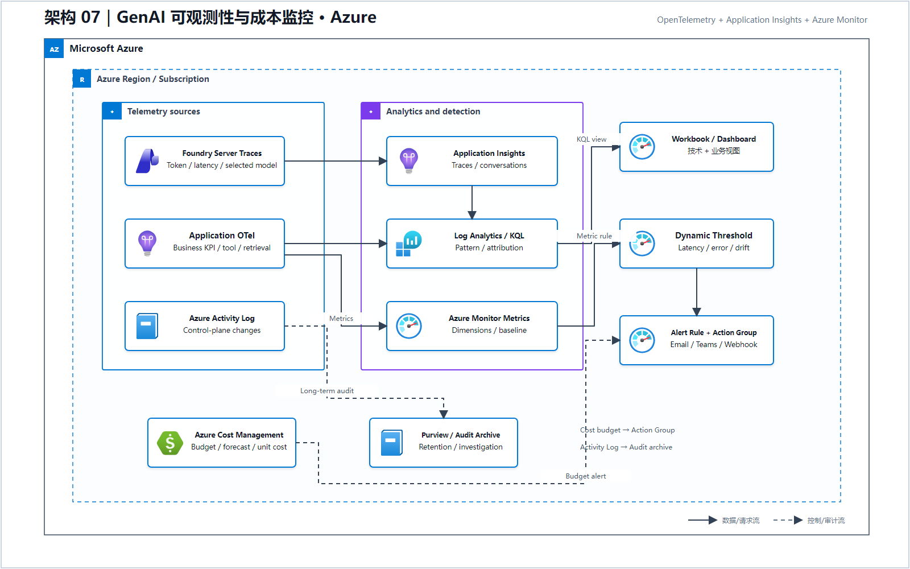
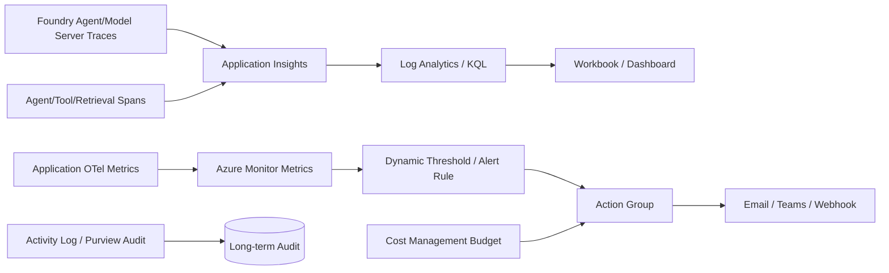

# 07 GenAI 可观测性与成本监控（Microsoft Foundry）

> AWS 源场景：Invocation Logging + CloudWatch + X-Ray + CloudTrail + SNS。

## Azure 架构图

可编辑源图：[07-genai-observability-azure.svg](diagrams/07-genai-observability-azure.svg)

## 三层证据架构

## 必须同时观察的信号

1. **平台指标**：Latency、Error、Throttle、Availability；
2. **模型指标**：Input/Output Token、Selected Model、Groundedness、Safety、Tool failure；
3. **业务指标**：转化率、任务完成率、人工升级率、单任务成本；
4. **审计证据**：谁修改了模型、护栏、配置和访问权限。

## 1:1 功能映射

| AWS | Azure |
|---|---|
| CloudWatch Logs/Metrics | Application Insights + Azure Monitor + Log Analytics |
| X-Ray | OpenTelemetry traces stored in Application Insights |
| Anomaly Detection | Dynamic thresholds / Smart Detection / KQL scheduled rule |
| CloudWatch Dashboard | Azure Monitor Workbook / Dashboard |
| Composite Alarm + SNS | Alert processing + Action Group |
| CloudTrail | Azure Activity Log；数据面另配服务审计/Purview |

## 关键注意事项

- Foundry tracing 会捕获 Prompt、Response、Tool call 等客户数据，启用前必须确定 RBAC、脱敏和保留期；
- Foundry Agent Service 的 server-side tracing 在连接 Application Insights 后可用；应用自定义逻辑仍需 client-side OTel；
- 仅用 Cost Management 月度账单无法定位单个 Agent/Tool；必须添加项目、部署、租户、Agent 和 Tool 维度；
- Dashboard 是展示层，不替代 Alert Rule、Action Group 和自动化响应。

## 官方依据

- [Foundry Agent Tracing](https://learn.microsoft.com/en-us/azure/foundry/observability/how-to/trace-agent-setup)
- [Foundry trace data handling](https://learn.microsoft.com/en-us/azure/foundry/observability/concepts/trace-data)
- [Azure Monitor](https://learn.microsoft.com/en-us/azure/azure-monitor/overview)

---

## 系列导航

- 上一篇：[06 评估驱动的发布门禁](./06_评估驱动的发布门禁.md)
- 下一篇：[08 Serverless 编排与人工审批](./08_Serverless_编排与人工审批.md)
