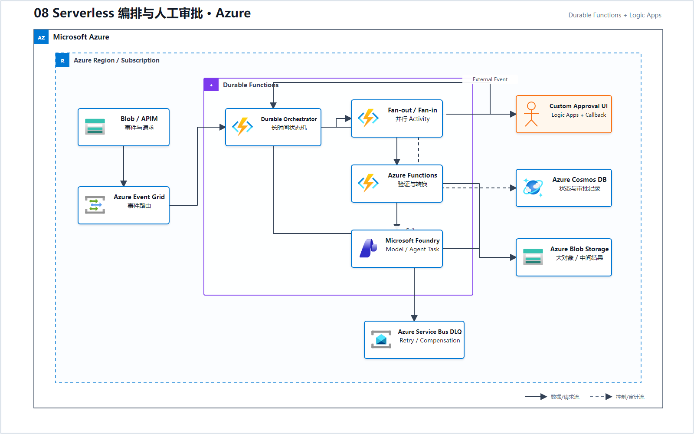
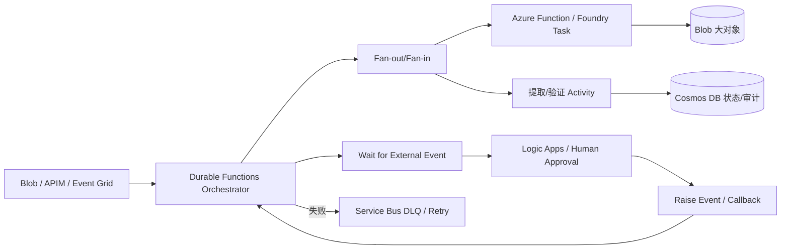

# 08 Serverless 编排与人工审批（Microsoft Foundry）

> AWS 源场景：Step Functions、Lambda、EventBridge、SQS、S3、DynamoDB。

## Azure 架构图

可编辑源图：[08-serverless-orchestration-azure.svg](diagrams/08-serverless-orchestration-azure.svg)

## 标准架构

## 模式映射

| Step Functions 模式 | Azure 对应 |
|---|---|
| Parallel / Map | Durable Functions fan-out/fan-in；并行 Activity |
| Retry / Catch / Timeout | Durable Task retry policy + exception/timeout handling |
| Task Token | Durable external event 或 Logic Apps callback |
| Standard 长流程 | Durable Functions 或 Logic Apps Standard |
| Express 高频短流程 | Event Grid + Functions；必要时 Logic Apps consumption |
| S3 大对象传引用 | Blob Storage 保存 payload，编排状态只传 URI |
| DynamoDB 状态/审计 | Durable backend + Cosmos DB/Storage 业务审计 |

## Durable Functions 与 Foundry Workflow 的边界

- AI Agent 之间的内容协作可以使用 Foundry Workflow/Agent Framework；
- 有确定状态、补偿、外部回调、超时和财务审计时，使用 Durable Functions/Logic Apps 作为外层控制器；
- 人工审批不可仅依赖内存中的对话状态；审批请求、操作者和结果要持久化；
- Service Bus 负责解耦和 DLQ，不替代 Orchestrator 的业务状态机。
- Logic Apps/Power Apps/业务审核台组成的是自建人工审批闭环，不应写成 Amazon A2I 的原生 1:1 产品替代。

## 官方依据

- [Durable Functions 概览](https://learn.microsoft.com/en-us/azure/azure-functions/durable/durable-functions-overview)
- [Foundry Workflows](https://learn.microsoft.com/azure/foundry/agents/concepts/workflow)
- [Azure Service Bus dead-letter queues](https://learn.microsoft.com/en-us/azure/service-bus-messaging/service-bus-dead-letter-queues)

---

## 系列导航

- 上一篇：[07 GenAI 可观测性与成本监控](./07_GenAI_可观测性与成本监控.md)
- 下一篇：[09 低延迟流式 AI](./09_低延迟流式_AI.md)
