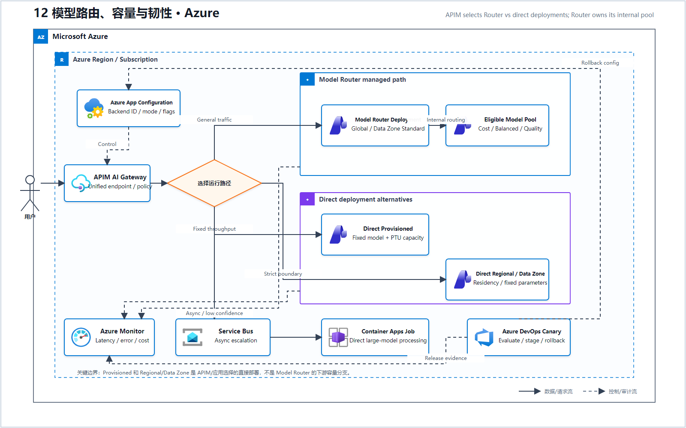
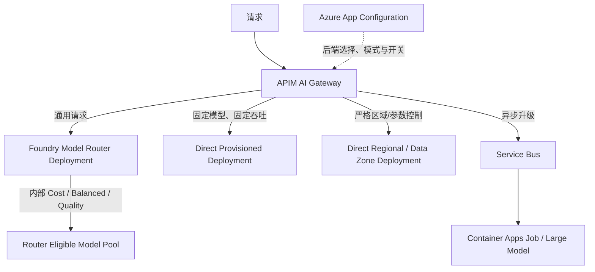
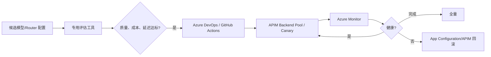
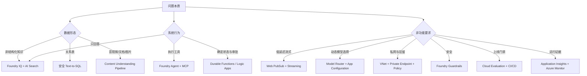

# 12 模型路由、容量与韧性（Microsoft Foundry）

> AWS 源场景：AppConfig、Provisioned Throughput、Cross-Region Inference、SQS/Fargate、Canary。

## Azure 架构图

可编辑源图：[12-model-routing-resilience-azure.svg](diagrams/12-model-routing-resilience-azure.svg)

## 运行时路由与降级

## 发布与回滚

## 容量决策

| 信号 | Azure 方案 |
|---|---|
| 按请求复杂度优化成本/质量 | Foundry Model Router：Cost、Balanced、Quality；当前 Router 部署类型为 Global Standard 或 Data Zone Standard |
| 稳定且可预测的高吞吐 | Provisioned deployment/Provisioned throughput（按模型支持情况） |
| 无需重新部署切模式/后端 | Azure App Configuration + APIM backend policy |
| 多模型统一入口、配额和熔断 | APIM AI Gateway |
| 区域与数据驻留 | Regional/Data Zone deployment；Azure Policy 限制不合规范围 |
| 低置信度异步升级 | Service Bus + Container Apps Job/Functions |
| 自动回滚 | Evaluation Gate + APIM/应用 canary + Azure Monitor |

## Model Router 不变量

- Router 是轻量路由模型，不是生成模型；
- Router 在自己的 deployment 内选择 eligible model pool；除文档明确要求的 Claude 等模型外，不需要把底层候选模型逐个部署。
- Provisioned、严格单区域或固定参数模型是 APIM/应用选择的**直接部署旁路**，不是 Router 会路由到的三个“容量分支”。
- 响应会披露实际选择的模型，应写入遥测；
- Router 不保存 Prompt，但部署边界和候选模型集合仍需符合数据驻留要求；
- 不能假设 Router 永远优于固定模型，必须用真实 workload 与基线比较；
- Foundry Evaluation 不直接集成 Router，使用官方专用评估工具比较质量、成本和延迟。

## 全局选型速查

## 建议学习顺序

1. Foundry IQ + Azure AI Search；
2. Foundry Guardrails + APIM AI Gateway；
3. Durable Functions/Logic Apps；
4. Prompt-as-code + App Configuration；
5. Foundry Evaluation + CI/CD Gate；
6. Application Insights + Azure Monitor；
7. Foundry Agent Service + Agent Framework；
8. Streaming、Content Understanding、Text-to-SQL；
9. Private networking、multi-subscription governance、Model Router 与容量。

## 官方依据

- [Foundry Model Router 原理](https://learn.microsoft.com/en-us/azure/foundry/openai/concepts/model-router-how-it-works)
- [使用和评估 Model Router](https://learn.microsoft.com/en-us/azure/foundry/openai/how-to/model-router)
- [Model Router 当前部署类型](https://learn.microsoft.com/en-us/azure/foundry/foundry-models/whats-new-model-router)
- [APIM AI Gateway](https://learn.microsoft.com/en-us/azure/api-management/genai-gateway-capabilities)

---

## 系列导航

- 上一篇：[11 多模态内容摄取流水线](./11_多模态内容摄取流水线.md)
- 系列总览：[01 企业级托管 RAG](./01_企业级托管_RAG.md)
