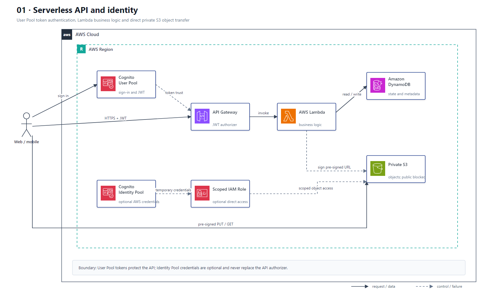

# 01 Serverless API 与身份认证

## AWS 架构图

## 架构目标

构建具备用户认证、细粒度授权、无服务器业务逻辑和托管数据层的 API。API 请求与大对象传输分离，避免 Lambda 代理文件内容。

## 请求与数据流

1. Web 或移动客户端在 Amazon Cognito User Pool 完成登录并取得 ID Token 或 Access Token。
2. 客户端把 Token 放入 `Authorization` 头，API Gateway Authorizer 验证签名、过期时间和 Scope。
3. API Gateway 调用 Lambda；Lambda 使用执行角色访问 DynamoDB，并在需要上传或下载对象时生成 S3 预签名 URL。
4. 客户端使用预签名 URL 直接访问私有 S3 Bucket，大对象不经过 API Gateway 和 Lambda。
5. 只有客户端确实需要临时 AWS 凭证直接调用 AWS API 时，才增加 Cognito Identity Pool；它不属于 User Pool Token 调用 API 的必经路径。

## 关键架构决策

| 架构需求 | 推荐设计 |
|---|---|
| 用户注册、登录和 JWT | Cognito User Pool |
| 客户端临时 AWS 凭证 | Cognito Identity Pool + IAM Role |
| API 鉴权 | API Gateway JWT/Cognito Authorizer |
| 业务逻辑与授权上下文处理 | Lambda + 最小权限执行角色 |
| 状态与元数据 | DynamoDB，按访问模式设计主键 |
| 大对象上传下载 | 私有 S3 + 预签名 URL |

## 架构设计要点

- User Pool 解决用户目录和 Token，Identity Pool 解决临时 AWS 凭证，两者职责不能混画。
- Lambda 只获得所需表、索引和对象前缀的访问权限；S3 保持 Block Public Access。
- 写操作使用幂等键和 DynamoDB 条件写，避免客户端重试产生重复副作用。
- API Gateway 配置限流、访问日志和错误响应；Lambda 输出结构化日志、指标和 Trace。
