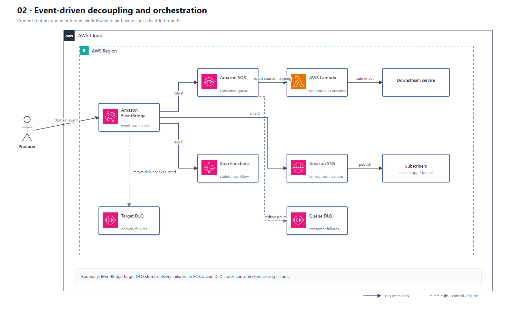

# 02 事件驱动解耦与编排

## AWS 架构图

## 架构目标

让生产者与消费者独立扩缩、独立失败，并为事件路由、削峰、重试、失败隔离和多步骤业务流程提供清晰边界。

## 事件与失败流

1. 业务服务或 AWS 服务把领域事件发送到 EventBridge Event Bus。
2. EventBridge Rule 按事件内容匹配，并把事件分别路由到 SQS、Step Functions 或 SNS 等目标。
3. 每类异步消费者使用独立 SQS Queue 缓冲；Lambda 通过 Event Source Mapping 批量拉取消息。
4. 消费失败时由 SQS 可见性超时和 Redrive Policy 控制重试，超过接收次数后进入该队列自己的 DLQ。
5. EventBridge 无法投递目标时进入 EventBridge Target DLQ；它与业务 SQS Queue 的 DLQ 是两条不同失败路径。
6. 需要显式步骤、等待、分支、补偿或长时间编排时，由 Step Functions 管理状态，不把流程状态隐藏在多个 Lambda 中。

## 关键架构决策

| 架构需求 | 推荐设计 |
|---|---|
| 内容路由和跨服务事件总线 | EventBridge |
| 削峰、消费者隔离和可控重试 | SQS |
| 一对多推送通知 | SNS + Subscription Filter Policy |
| 有状态步骤、分支和补偿 | Step Functions |
| 队列消费者 | Lambda Event Source Mapping 或容器 Worker |

## 架构设计要点

- 消费者必须幂等，因为 EventBridge、SQS 和 Lambda 都可能产生重复投递。
- SQS Visibility Timeout 应覆盖函数最大处理时间和重试余量；批处理使用 Partial Batch Response 隔离失败消息。
- 跨账户 Event Bus、SQS Target 和 DLQ 都需要显式资源策略与最小权限角色。
- 为队列深度、消息年龄、DLQ 数量、EventBridge 投递失败和 Lambda 错误建立告警。
