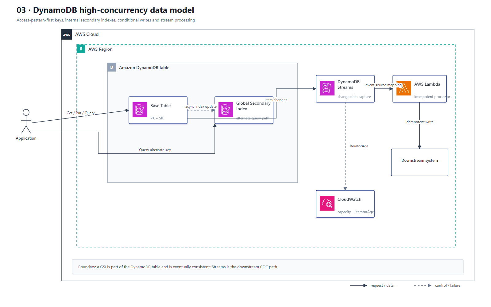

# 03 DynamoDB 高并发数据模式

## AWS 架构图

## 架构目标

从业务访问模式反推单表主键和索引，支撑高并发读写、幂等更新、自动过期和表级变更事件处理。

## 请求与变更流

1. 应用通过 DynamoDB API 对 Base Table 执行 `GetItem`、`PutItem`、`UpdateItem` 或 `Query`。
2. 主访问模式由 Partition Key 和 Sort Key 支撑；替代查询路径通过 GSI 查询。
3. GSI 是表的索引结构，不是下游数据库；索引更新异步传播，只支持最终一致性读取。
4. 条件表达式与唯一请求 ID 共同实现乐观并发控制和幂等写入。
5. DynamoDB Streams 捕获项目级变更，由 Lambda Event Source Mapping 批量处理并写入下游系统。
6. TTL 异步清理过期项目；业务不能把 TTL 删除时间当成精确调度器。

## 关键架构决策

| 架构需求 | 推荐设计 |
|---|---|
| 主查询路径 | 复合主键 PK/SK + Query |
| 替代查询路径 | GSI，接受最终一致性 |
| 幂等和并发控制 | Condition Expression + 请求幂等键 |
| 数据变更事件 | DynamoDB Streams + Lambda |
| 临时数据清理 | TTL |
| 突发或不可预测流量 | On-Demand；稳定流量可用 Provisioned + Auto Scaling |

## 架构设计要点

- 避免 Scan 驱动的设计；先列出访问模式，再定义 PK、SK 和 GSI。
- 使用高基数、均匀分布的 Partition Key，避免热点分区和单键写入瓶颈。
- `BatchGetItem` 和 `BatchWriteItem` 返回未处理项目时，只重试未处理部分并使用指数退避。
- Streams 和 Lambda 属于至少一次处理路径，下游写入仍需幂等，并监控 IteratorAge。
