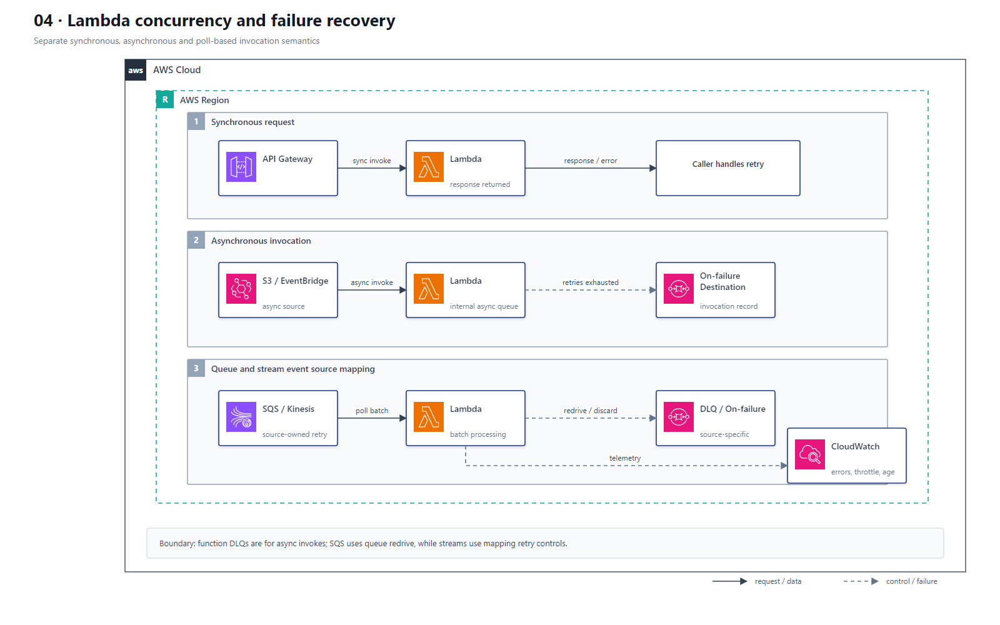

# 04 Lambda 性能、并发与失败恢复

## AWS 架构图

## 架构目标

针对同步调用、异步调用和队列/流 Event Source Mapping 分别设计容量、重试与失败保留，避免把三种调用模型的恢复机制混为一谈。

## 调用与失败流

1. API Gateway 同步调用 Lambda，函数错误直接返回调用方；重试策略由调用方决定。
2. S3、EventBridge 等异步调用先进入 Lambda 内部异步队列；失败达到重试或事件年龄上限后进入 On-Failure Destination 或函数 DLQ。
3. SQS、Kinesis 和 DynamoDB Streams 由 Event Source Mapping 拉取批次；失败行为由源服务和 Mapping 配置控制。
4. SQS 使用源 Queue 的 Redrive Policy；Kinesis 和 DynamoDB Streams 使用最大重试、最大记录年龄、Bisect Batch 与 On-Failure Destination。
5. Reserved Concurrency 为函数预留并限制最大并发；Provisioned Concurrency 预初始化执行环境以降低冷启动。
6. CloudWatch Logs、Metrics 和 X-Ray 记录执行结果，并对 Throttles、Errors、Duration、IteratorAge 和 DLQ 建立告警。

## 关键架构决策

| 架构需求 | 推荐设计 |
|---|---|
| 保护下游并限制最大并发 | Reserved Concurrency |
| 稳定低冷启动延迟 | Provisioned Concurrency + Alias |
| 异步调用失败保留 | On-Failure Destination，或函数 DLQ |
| SQS 消费失败 | Queue Redrive Policy + DLQ |
| 流批次毒消息隔离 | Partial Batch、Bisect Batch、最大重试和 On-Failure Destination |
| CPU 密集型函数优化 | 调整 Memory，同时测量 Duration 与成本 |

## 架构设计要点

- Reserved Concurrency 同时是预留和上限，不等同于预热；Provisioned Concurrency 才用于预初始化环境。
- 函数初始化阶段复用 SDK Client 和数据库连接，但不能把请求级可变状态泄漏给下一次调用。
- Timeout 必须小于上游超时并留出失败处理空间；对下游调用配置连接、读取超时和退避。
- 用 Lambda Power Tuning 或等价压测选择 Memory，不只按单次执行价格判断。
