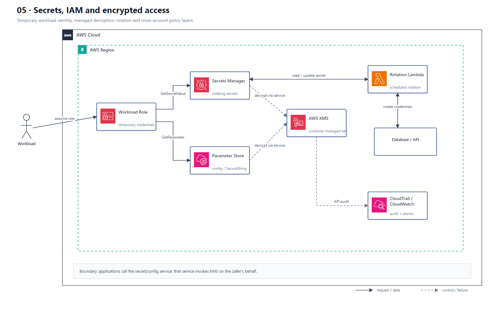

# 05 Secrets、IAM 与加密访问

## AWS 架构图

## 架构目标

让工作负载通过临时角色凭证访问配置和秘密，由托管服务调用 KMS 完成加解密，并把轮换、跨账户授权和审计纳入同一权限边界。

## 权限与秘密流

1. Lambda、EC2、ECS 或 EKS 工作负载获得执行角色、实例角色、Task Role 或 Pod Identity，而不是持有长期 Access Key。
2. 应用凭临时角色调用 Secrets Manager `GetSecretValue` 或 Parameter Store `GetParameter`。
3. Secrets Manager 和 Parameter Store 代表调用方使用 KMS Key 解密数据；应用通常不需要直接调用 KMS 解密密文。
4. 数据库秘密启用托管轮换或 Rotation Lambda，轮换函数同时访问 Secret 和目标数据库。
5. 跨账户读取 Secret 同时需要调用方 IAM Policy、Secret Resource Policy 和 Customer Managed KMS Key Policy。
6. CloudTrail 记录秘密和密钥 API 调用，CloudWatch 对轮换失败和异常访问建立告警。

## 关键架构决策

| 架构需求 | 推荐设计 |
|---|---|
| 可轮换数据库或 API 凭证 | Secrets Manager |
| 普通配置或 SecureString | Systems Manager Parameter Store |
| 工作负载身份 | 服务原生 IAM Role，不保存长期密钥 |
| 加密控制 | Customer Managed KMS Key + 最小权限 Key Policy |
| 跨账户秘密读取 | IAM Policy + Secret Resource Policy + KMS Key Policy |

## 架构设计要点

- 严格区分身份策略、资源策略和 KMS Key Policy；跨账户场景缺一不可。
- 限制 `GetSecretValue` 到具体 Secret ARN，并通过 `kms:ViaService` 等条件缩小密钥使用范围。
- 对高频读取使用客户端缓存或 Parameters and Secrets Lambda Extension，降低延迟与 API 成本。
- 不把 Secret 值写入环境日志、异常信息、构建日志或部署输出。
