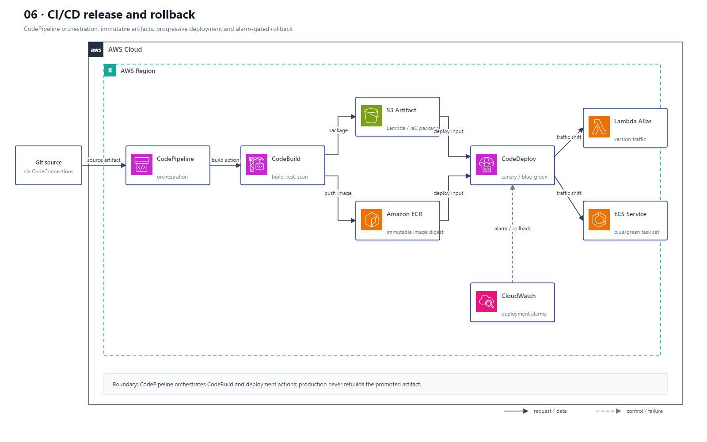

# 06 CI/CD、版本发布与回滚

## AWS 架构图

## 架构目标

由 CodePipeline 编排源码、构建、测试、安全检查、发布和回滚，确保制品不可变、部署可审计、流量迁移受指标保护。

## 构建与发布流

1. Git 仓库通过 Source Action 或 CodeConnections 把版本化源码制品交给 CodePipeline。
2. CodePipeline 调用 CodeBuild 编译、单元测试、打包并执行依赖和镜像安全扫描。
3. Lambda/CloudFormation 制品进入 S3 Artifact Bucket；容器镜像以不可变 Tag 或 Digest 推送到 ECR。
4. Deploy Stage 调用 CodeDeploy、CloudFormation、ECS 或 Lambda Deploy Action 发布目标版本。
5. Lambda 使用 Version + Alias 做 Canary/Linear 流量迁移；ECS 使用 Blue/Green Task Set 与负载均衡器切流。
6. CloudWatch Alarm 或验证 Hook 失败时中止部署并回滚到上一稳定版本。

## 关键架构决策

| 架构需求 | 推荐设计 |
|---|---|
| 流程编排和审批 | CodePipeline |
| 构建、测试和扫描 | CodeBuild |
| Lambda 渐进式发布 | Version + Alias + CodeDeploy/Lambda Deploy Action |
| ECS 无停机发布 | CodeDeploy Blue/Green |
| 基础设施部署 | CloudFormation Change Set |
| 自动回滚门禁 | CloudWatch Alarm + Deployment Hook |

## 架构设计要点

- CodePipeline 是编排入口，CodeBuild 是被调用的构建阶段，不能把两者顺序反画。
- 构建一次并在各环境提升同一制品，禁止生产阶段重新编译。
- Pipeline Role、Build Role 和 Deploy Role 分离，并只授权各阶段所需资源。
- 为 Artifact Bucket 和 ECR 启用加密、版本控制、生命周期和不可变制品策略。
