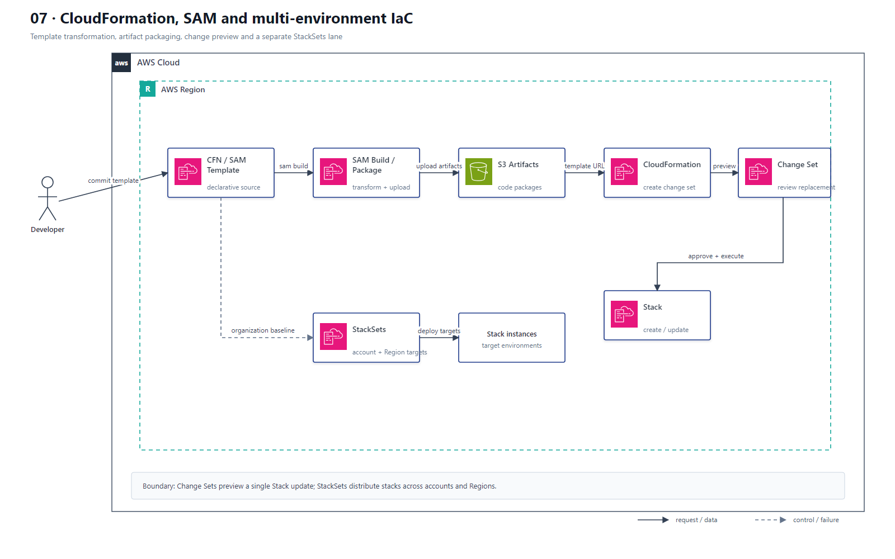

# 07 CloudFormation、SAM 与多环境 IaC

## AWS 架构图

## 架构目标

通过声明式模板、参数、变更预览和受控执行管理环境；Serverless 资源使用 SAM 简化定义，多账户多 Region 基线使用 StackSets 分发。

## 模板与部署流

1. 开发者维护 CloudFormation 或带 `AWS::Serverless` Transform 的 SAM Template。
2. SAM CLI 构建并打包函数制品，把代码上传到 S3，再把转换后的模板交给 CloudFormation。
3. CloudFormation 针对目标 Stack 创建 Change Set，展示新增、修改、删除及 Replacement 风险。
4. 审批后执行 Change Set，CloudFormation 创建或更新资源，并在失败时按栈语义回滚。
5. StackSets 以同一模板向指定账户和 Region 创建 Stack Instance；它不是单个 Stack 更新的必经步骤。
6. DeletionPolicy、UpdateReplacePolicy 和 Stack Policy 保护数据库、Bucket 等关键有状态资源。

## 关键架构决策

| 架构需求 | 推荐设计 |
|---|---|
| 通用声明式基础设施 | CloudFormation Template + Stack |
| Serverless 简化定义 | AWS SAM Transform |
| 变更风险预览 | Change Set |
| 防止删除有状态资源 | DeletionPolicy / UpdateReplacePolicy |
| 限制关键资源更新 | Stack Policy |
| 多账户多 Region 部署 | CloudFormation StackSets |

## 架构设计要点

- 参数只表达环境差异；敏感值使用动态引用，不写入模板、参数默认值或 Output。
- 在执行 Change Set 前重点检查资源 Replacement，尤其是数据库、网络和持久存储。
- 按应用或生命周期边界拆分 Stack，并通过 Export、SSM Parameter 或 Pipeline 参数传递依赖。
- StackSets 设置并发度、失败容忍和 Region 顺序，避免一次错误覆盖全部账户。
