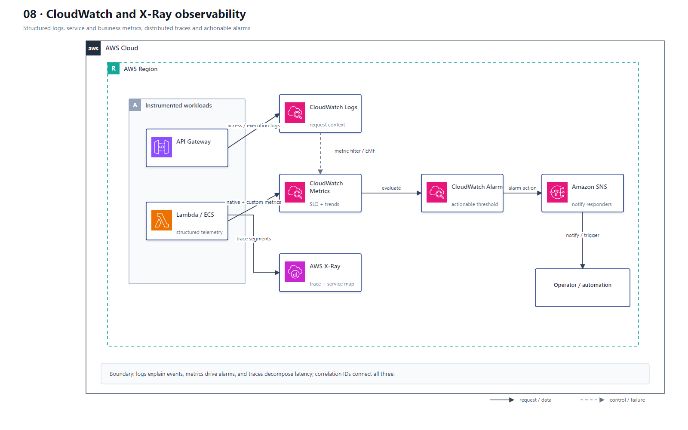

# 08 CloudWatch 与 X-Ray 可观测性

## AWS 架构图

## 架构目标

用日志解释单次请求、用指标观察系统趋势、用 Trace 定位跨服务瓶颈，并把告警连接到可执行的通知和响应流程。

## 遥测与告警流

1. API Gateway、Lambda、EC2、ECS 和 EKS 工作负载输出结构化应用日志到 CloudWatch Logs。
2. AWS 服务原生指标与应用自定义指标进入 CloudWatch Metrics；日志中的业务事件可通过 Metric Filter 或 Embedded Metric Format 转成指标。
3. API Gateway 和 Lambda 启用 Active Tracing，应用通过 X-Ray SDK、ADOT 或服务集成产生 Segment/Subsegment。
4. 日志、指标和 Trace 统一携带请求 ID、Trace ID 和业务关联 ID，支持跨信号定位。
5. CloudWatch Alarm 评估错误率、延迟、节流、积压和资源饱和度，并通过 SNS 或事件自动化通知响应方。

## 关键架构决策

| 架构需求 | 推荐设计 |
|---|---|
| 请求详情和错误上下文 | CloudWatch Logs |
| 趋势、SLO 和告警 | CloudWatch Metrics + Alarms |
| 跨服务调用链和延迟分解 | AWS X-Ray / CloudWatch Application Signals |
| 业务指标 | Embedded Metric Format 或 PutMetricData |
| 通知与自动响应 | SNS / EventBridge / Systems Manager Automation |

## 架构设计要点

- API Gateway 的 Latency 与 IntegrationLatency 分别表示端到端时间和后端集成时间，应联合分析。
- Lambda 托管运行环境不需要自行运行 X-Ray Daemon；EC2 或自管容器需要 Collector/Daemon 或 ADOT。
- 日志采用 JSON 并控制敏感字段、采样和保留周期，避免把秘密或个人数据写入日志。
- 告警应针对用户影响和可操作信号，使用 Composite Alarm 降低重复告警。
