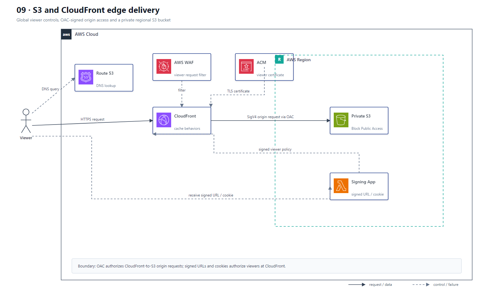

# 09 S3 + CloudFront 静态与边缘交付

## AWS 架构图

## 架构目标

通过 CloudFront 在全球边缘缓存静态内容，以 OAC 保护私有 S3 源站，并分别控制 Viewer 访问和 Origin 访问。

## 请求与授权流

1. 用户通过 Route 53 域名和 HTTPS 访问 CloudFront；ACM 证书终止 Viewer TLS，可选 AWS WAF 在边缘过滤请求。
2. CloudFront 按 Cache Behavior、Cache Key 和 TTL 命中边缘缓存，未命中时访问 S3 Origin。
3. Origin Access Control 对 CloudFront 到 S3 的请求执行 SigV4 签名；S3 Bucket Policy 只允许指定 Distribution 读取。
4. S3 保持 Block Public Access，用户不能绕过 CloudFront 直接访问对象。
5. 受限内容由应用签发 CloudFront Signed URL 或 Signed Cookie，CloudFront 在 Viewer 侧校验权限和有效期。
6. CORS 只解决浏览器跨源读取，不替代身份认证、Bucket Policy 或 Signed URL。

## 关键架构决策

| 架构需求 | 推荐设计 |
|---|---|
| 全球静态内容缓存 | CloudFront |
| 私有 S3 Origin | OAC + Bucket Policy + Block Public Access |
| 单个受限对象 | CloudFront Signed URL |
| 一组受限对象或流媒体分片 | CloudFront Signed Cookie |
| 自定义域名与 TLS | Route 53 + ACM |
| 边缘 Web 防护 | AWS WAF，可选 Shield Advanced |

## 架构设计要点

- OAC 是 CloudFront 到 S3 的 Origin 授权机制，不是 Viewer 请求路径中的独立代理节点；OAI 仅作为旧架构兼容项。
- Cache Key 只包含真正影响响应的 Header、Cookie 和 Query String，避免无效碎片化缓存。
- 版本化静态文件名优于频繁 Invalidations；HTML 可使用短 TTL，带 Hash 的资源使用长 TTL。
- 同时记录 CloudFront 访问日志、S3 数据事件和 WAF 日志，以区分边缘拒绝、缓存和源站问题。
