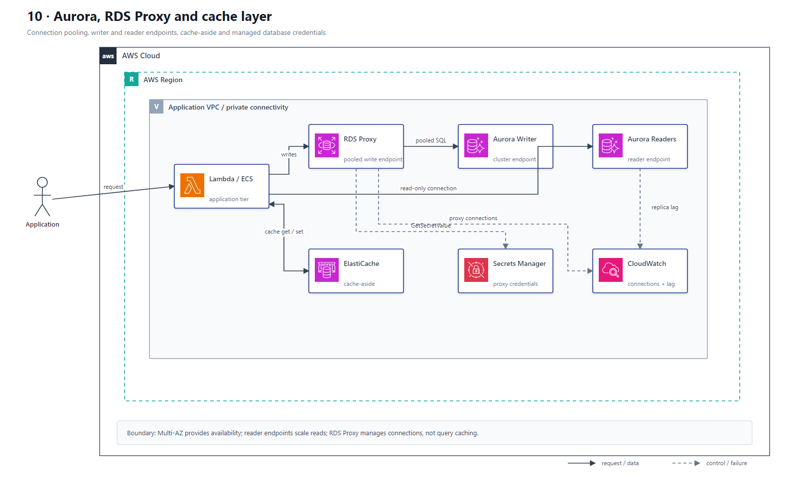

# 10 RDS、Aurora 与缓存连接层

## AWS 架构图

## 架构目标

把连接管理、读写路由、高可用和缓存分层，保护关系数据库免受 Serverless 突发连接和热点读取冲击。

## 连接与数据流

1. Lambda、ECS 或 EC2 应用部署在可访问数据库的 VPC 和安全组边界内。
2. 写请求通过 RDS Proxy 连接池进入 Aurora Cluster/Writer Endpoint；Proxy 复用连接并改善故障切换期间的连接恢复。
3. 读密集请求通过 Aurora Reader Endpoint，或按需要配置 RDS Proxy Read-Only Endpoint，分散到 Aurora Replicas。
4. 应用使用 Cache-Aside 模式访问 ElastiCache：先读缓存，未命中再查数据库并写回缓存。
5. RDS Proxy 使用 Secrets Manager 数据库凭证，或使用端到端 IAM Authentication；应用不保存静态密码。
6. CloudWatch 监控连接数、Proxy Pinning、数据库负载、Replica Lag、缓存命中率和 Eviction。

## 关键架构决策

| 架构需求 | 推荐设计 |
|---|---|
| Serverless 突发连接 | RDS Proxy |
| 关系型写入和事务 | Aurora Writer/Cluster Endpoint |
| 读取扩展 | Aurora Reader Endpoint / Read-Only Proxy Endpoint |
| 热点对象和 Session | ElastiCache，通常使用 Redis/Valkey |
| 数据库凭证 | Secrets Manager 或端到端 IAM Authentication |
| 高可用 | Multi-AZ/Aurora Replica，不把 Read Replica 等同备份 |

## 架构设计要点

- Multi-AZ 主要解决高可用，Reader/Read Replica 解决读取扩展，职责必须分开。
- Reader Endpoint 平衡的是新连接，不是单条 SQL；连接池过长会降低负载分散效果。
- 缓存需要明确 TTL、失效、穿透、击穿和一致性策略，不能把 ElastiCache 当作权威数据源。
- Lambda 访问数据库需要 VPC 网络、Security Group 和超时配置，并监控 Proxy 连接固定导致的复用下降。
