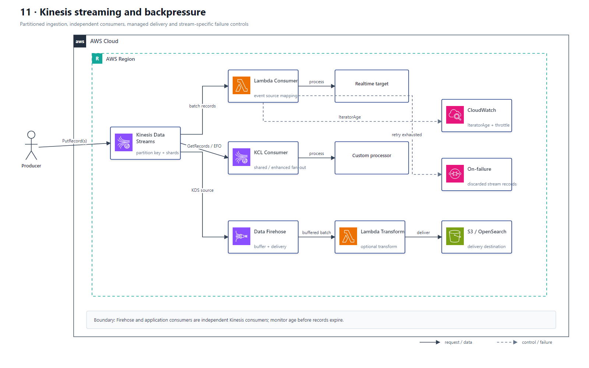

# 11 Kinesis 流式处理与背压

## AWS 架构图

## 架构目标

按 Partition Key 保持分片内顺序，通过独立实时消费者和交付管道处理持续数据流，并对生产、消费和下游积压实施背压控制。

## 流式数据与失败流

1. Producer 使用 `PutRecord` 或 `PutRecords` 把记录写入 Kinesis Data Streams，Partition Key 决定 Shard 分布和顺序边界。
2. Lambda Event Source Mapping 或 KCL Consumer 从各 Shard 读取记录；多个高吞吐消费者可使用 Enhanced Fan-Out 获得独立读吞吐。
3. Lambda 流消费者启用 Partial Batch Response、Bisect Batch、最大重试和最大记录年龄，并把最终失败记录发送到 On-Failure Destination。
4. Amazon Data Firehose 可把 Kinesis Data Streams 作为来源，独立缓冲并按批次交付 S3、OpenSearch 等目标。
5. Firehose 可同步调用 Lambda 转换批次；转换失败记录进入配置的 Backup/Failure 路径。
6. CloudWatch 监控写入节流、读取节流、IteratorAge、MillisBehindLatest 和 Firehose DeliveryTo* 指标。

## 关键架构决策

| 架构需求 | 推荐设计 |
|---|---|
| 可重放、分片有序实时流 | Kinesis Data Streams |
| Lambda 批量流处理 | Event Source Mapping |
| 自定义长期消费者 | KCL |
| 多消费者独立读吞吐 | Enhanced Fan-Out |
| 托管缓冲和目标交付 | Amazon Data Firehose |
| 下游格式转换 | Firehose + Lambda Transform |

## 架构设计要点

- Partition Key 必须均匀分布；单个热点 Key 会让一个 Shard 先达到吞吐上限。
- `PutRecords` 可能部分成功，只重试失败记录并使用指数退避，避免整批重复写入。
- IteratorAge 上升先判断消费者计算不足、下游变慢还是 Shard 吞吐不足，再分别扩并发、隔离下游或 Reshard。
- Kinesis 是可重放的持续流，SQS 是消息队列；不能仅因为“异步”就互相替代。
