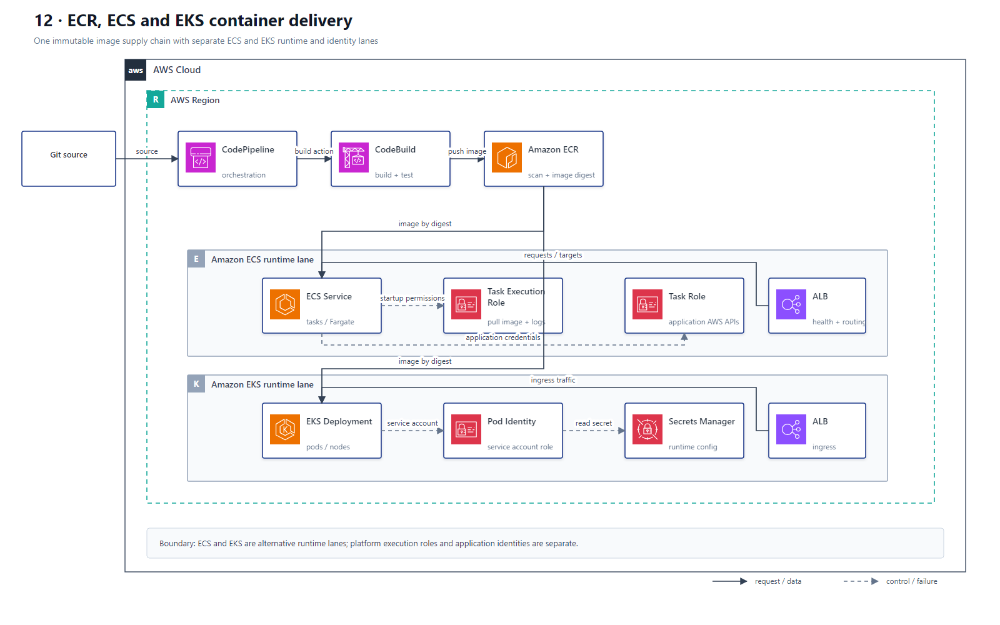

# 12 ECR、ECS 与 EKS 容器交付

## AWS 架构图

## 架构目标

从源码构建不可变镜像，经安全扫描后部署到 ECS 或 EKS，并把平台启动权限与容器内应用权限严格分离。

## 镜像与部署流

1. CodePipeline 编排 Source、Build、Scan 和 Deploy Stage，CodeBuild 构建容器镜像。
2. CodeBuild 使用专用角色把镜像推送到 ECR；ECR 对镜像执行扫描并保留不可变 Tag 或 Digest。
3. ECS Service 或 EKS Deployment 从 ECR 拉取已批准镜像；ECS 与 EKS 是两条替代运行路径，不是同一请求链上的连续服务。
4. ECS Task Execution Role 用于拉取镜像、读取启动时 Secret 和写日志；Task Role 只赋予容器内应用调用 AWS API 的权限。
5. EKS 使用 Pod Identity 或 IRSA 将 IAM Role 绑定到 Kubernetes Service Account，避免 Pod 继承 Node Role。
6. ALB 把流量路由到 ECS Task 或 EKS Service/Ingress；健康检查、CloudWatch Alarm 和部署控制器负责失败停止与回滚。

## 关键架构决策

| 架构需求 | 推荐设计 |
|---|---|
| 镜像仓库和扫描 | Amazon ECR |
| AWS 原生容器编排、较低运维 | Amazon ECS |
| Kubernetes API 和生态兼容 | Amazon EKS |
| ECS 平台启动权限 | Task Execution Role |
| ECS 应用运行时权限 | Task Role |
| EKS Pod 运行时权限 | EKS Pod Identity / IRSA |

## 架构设计要点

- 构建阶段生成一次镜像并按 Digest 在环境间提升，生产部署禁止重新构建。
- ECR 扫描结果必须成为 Pipeline 门禁；严重漏洞阻止部署而不是只生成报告。
- Secret 通过 Secrets Manager 或 Parameter Store 注入，不能写入 Dockerfile、镜像层或普通环境配置仓库。
- ECS/EKS 分别设计滚动或 Blue/Green 策略、最小健康实例比例、自动扩缩和可观测性。
