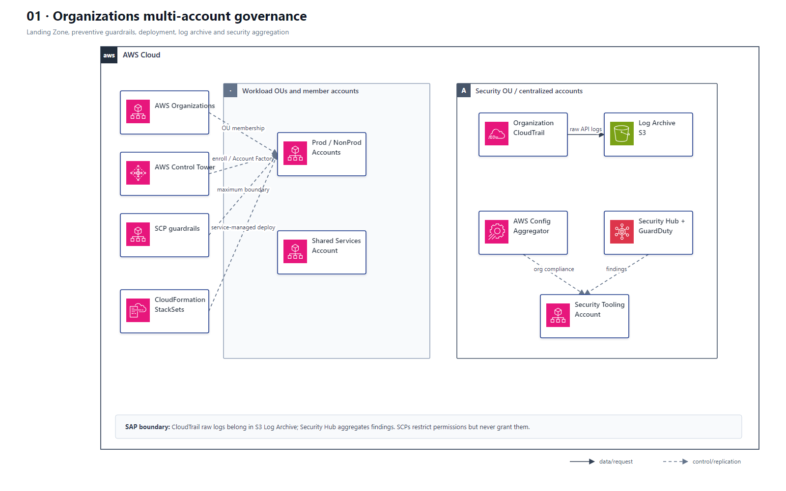

# 01 Organizations 多账户治理与 Landing Zone

## AWS 架构图

## 关键架构决策

| 架构需求 | 推荐设计 |
|---|---|
| 组织级限制服务/动作 | Organizations + SCP；显式 Deny 用于边界控制 |
| 新账户自动纳管 | Control Tower / Account Factory + Organizations |
| 跨账户统一资源部署 | CloudFormation StackSets，优先 service-managed permissions |
| 集中合规与安全 | CloudTrail→Log Archive；Config Aggregator 与 Security Hub→Security Tooling |

## 架构设计要点

- SCP 不授予权限，只定义组织层面的最大权限边界。
- CloudTrail 原始审计日志进入独立 Log Archive 账户中的 S3；Security Hub 聚合标准化安全发现，不是 CloudTrail 日志仓库。
- Config 组织聚合器与 Security Hub 承担不同职责；不要画成 Config 必须先经过 Security Hub 才能集中查看。
- 架构需要覆盖数百账户、自动纳管新账户或按 OU 部署时，优先考虑 Organizations + StackSets/Control Tower。
