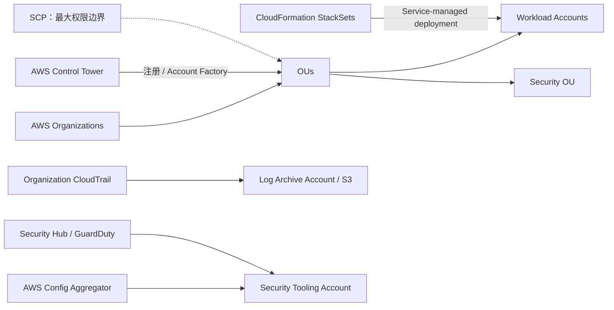

# 01 Organizations 多账户治理与 Landing Zone

> 系列：AWS SAP-C02 经典架构（20 场景）
>
> 架构语义已按 AWS 官方资料审计。当前工作区未包含 `aws-sap-c02-529-questions副本.md`，因此题号映射为 **NOT VERIFIED**，不应把代表题号视为已复核事实。

## AWS 架构图

可编辑源图：[01-organizations-governance.svg](diagrams/01-organizations-governance.svg)

## 核心架构

## 题库反复考的决策

| 判断问题 | 优先架构/服务 | 代表题号 |
|---|---|---|
| 组织级限制服务/动作 | Organizations + SCP；显式 Deny 用于边界控制 | Q3、Q31、Q32、Q44 |
| 新账户自动纳管 | Control Tower / Account Factory + Organizations | Q64、Q84、Q85、Q131 |
| 跨账户统一资源部署 | CloudFormation StackSets，优先 service-managed permissions | Q38、Q168、Q286、Q328、Q516 |
| 集中合规与安全 | CloudTrail→Log Archive；Config Aggregator 与 Security Hub→Security Tooling | Q110、Q118、Q270、Q370、Q419 |

## 架构审计要点

- SCP 不授予权限，只定义组织层面的最大权限边界。
- CloudTrail 原始审计日志进入独立 Log Archive 账户中的 S3；Security Hub 聚合标准化安全发现，不是 CloudTrail 日志仓库。
- Config 组织聚合器与 Security Hub 承担不同职责；不要画成 Config 必须先经过 Security Hub 才能集中查看。
- 题目出现“数百账户 / 自动覆盖新账户 / OU 级部署”时，优先考虑 Organizations + StackSets/Control Tower。

## 覆盖的代表题

Q3, Q31, Q32, Q38, Q57, Q64, Q84, Q85, Q110, Q118, Q131, Q168, Q270, Q286, Q328, Q334, Q370, Q410, Q419, Q516

---

## 系列导航

- 系列总览：[01 Organizations 多账户治理与 Landing Zone](./01_Organizations_多账户治理与_Landing_Zone.md)
- 下一篇：[02 共享网络 Transit Gateway、VPC Sharing 与 IPAM](./02_共享网络_Transit_Gateway_VPC_Sharing_与_IPAM.md)
