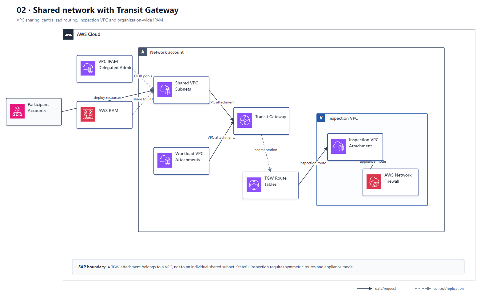
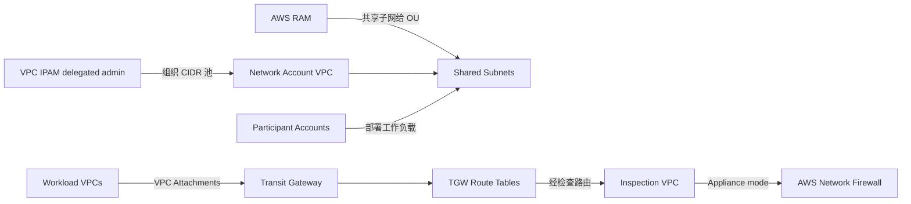

# 02 共享网络 Transit Gateway、VPC Sharing 与 IPAM

> 系列：AWS SAP-C02 经典架构（20 场景）
>
> 架构语义已按 AWS 官方资料审计。当前工作区未包含 `aws-sap-c02-529-questions副本.md`，因此题号映射为 **NOT VERIFIED**，不应把代表题号视为已复核事实。

## AWS 架构图

可编辑源图：[02-shared-network-tgw.svg](diagrams/02-shared-network-tgw.svg)

## 核心架构

## 题库反复考的决策

| 判断问题 | 优先架构/服务 | 代表题号 |
|---|---|---|
| 成员账户只能部署资源，不能管网络 | VPC Sharing + AWS RAM | Q11 |
| 大量 VPC 互联 | Transit Gateway，避免全网状 VPC Peering | Q30、Q53、Q181 |
| 组织级共享 TGW | RAM 分享 TGW，StackSets 自动创建 VPC/Attachment | Q30 |
| 地址空间治理 | VPC IPAM 统一 CIDR 分配与审计 | Q279、Q465 |

## 架构审计要点

- Shared VPC 的网络资源由拥有者账户管理；参与账户在共享子网中创建自己的工作负载。
- TGW attachment 属于 VPC，不是共享子网本身；共享子网和 TGW 互联是两个独立设计点。
- TGW route table 可以把 Prod、NonProd、Shared Services 做逻辑隔离；集中状态防火墙还要配 inspection VPC、对称路由和 appliance mode。
- IPAM 适合由组织委派管理员统一管理 CIDR 池、分配与合规性。

## 覆盖的代表题

Q11, Q30, Q53, Q118, Q131, Q181, Q215, Q230, Q279, Q340, Q446, Q465

---

## 系列导航

- 上一篇：[01 Organizations 多账户治理与 Landing Zone](./01_Organizations_多账户治理与_Landing_Zone.md)
- 系列总览：[01 Organizations 多账户治理与 Landing Zone](./01_Organizations_多账户治理与_Landing_Zone.md)
- 下一篇：[03 混合网络 Direct Connect、VPN 与 Route 53 Resolver](./03_混合网络_Direct_Connect_VPN_与_Route53_Resolver.md)
