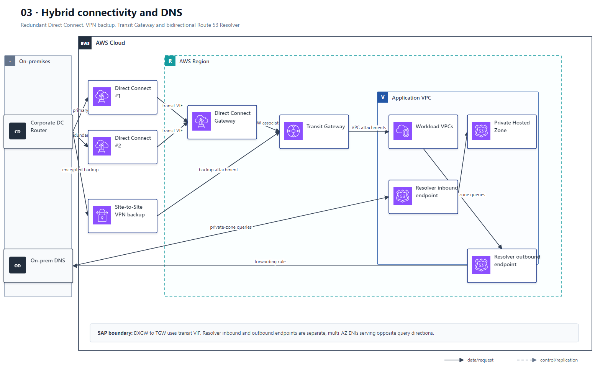

# 03 混合网络 Direct Connect、VPN 与 Route 53 Resolver

## AWS 架构图

## 关键架构决策

| 架构需求 | 推荐设计 |
|---|---|
| 本地解析 Route 53 Private Hosted Zone | Route 53 Resolver inbound endpoint + 条件转发 |
| DX 冗余且未来跨 Region | 双 DX + Direct Connect Gateway |
| DX 故障备份 | Site-to-Site VPN 作为备份链路 |
| 多 VPC / 多账户混合互联 | DX/DXGW → TGW → VPC Attachments |

## 架构设计要点

- Private Hosted Zone 本身不会自动让 on-prem DNS 可解析，需要 Resolver endpoint 与 DNS forwarding。
- Inbound 与 outbound endpoint 是分开的多 AZ ENI：前者接收 on-prem 查询，后者把 VPC 查询转发到 on-prem。
- DX Gateway 连接 Transit Gateway 时使用 transit VIF；private VIF 的目标是 VGW，不应把两类 VIF 混画。
- Direct Connect 提供私网专线但不等于默认加密；需要链路加密时通常还要 VPN over DX 或 MACsec（取决于场景）。
