# 03 混合网络 Direct Connect、VPN 与 Route 53 Resolver

> 系列：AWS SAP-C02 经典架构（20 场景）
>
> 架构语义已按 AWS 官方资料审计。当前工作区未包含 `aws-sap-c02-529-questions副本.md`，因此题号映射为 **NOT VERIFIED**，不应把代表题号视为已复核事实。

## AWS 架构图

可编辑源图：[03-hybrid-connectivity-dns.svg](diagrams/03-hybrid-connectivity-dns.svg)

## 核心架构

```mermaid
flowchart LR
    dc["Corporate DC"] -->|LAN| router["Customer Router"]
    router["Customer Router"] -->|Primary| dx1["Direct Connect #1"]
    router["Customer Router"] -->|Redundant| dx2["Direct Connect #2"]
    router["Customer Router"] -->|Backup path| vpn["Site-to-Site VPN"]
    dx1["Direct Connect #1"] -->|Transit VIF| dxgw["Direct Connect Gateway"]
    dx2["Direct Connect #2"] -->|Transit VIF| dxgw["Direct Connect Gateway"]
    dxgw["Direct Connect Gateway"] -->|TGW association| tgw["Transit Gateway"]
    vpn["Site-to-Site VPN"] -->|加密备份| tgw["Transit Gateway"]
    tgw["Transit Gateway"] -->|Attachment| vpc1["VPC A"]
    tgw["Transit Gateway"] -->|Attachment| vpc2["VPC B"]
    dns["On-Prem DNS"] -->|条件转发私有域| inbound["Resolver inbound endpoint"]
    inbound --> phz["Private Hosted Zone"]
    vpc1 -->|查询 on-prem 域| outbound["Resolver outbound endpoint"]
    outbound -->|Forwarding rule| dns
```

## 题库反复考的决策

| 判断问题 | 优先架构/服务 | 代表题号 |
|---|---|---|
| 本地解析 Route 53 Private Hosted Zone | Route 53 Resolver inbound endpoint + 条件转发 | Q1 |
| DX 冗余且未来跨 Region | 双 DX + Direct Connect Gateway | Q17 |
| DX 故障备份 | Site-to-Site VPN 作为备份链路 | Q65、Q77、Q99 |
| 多 VPC / 多账户混合互联 | DX/DXGW → TGW → VPC Attachments | Q116、Q123、Q215、Q232 |

## 架构审计要点

- Private Hosted Zone 本身不会自动让 on-prem DNS 可解析，需要 Resolver endpoint 与 DNS forwarding。
- Inbound 与 outbound endpoint 是分开的多 AZ ENI：前者接收 on-prem 查询，后者把 VPC 查询转发到 on-prem。
- DX Gateway 连接 Transit Gateway 时使用 transit VIF；private VIF 的目标是 VGW，不应把两类 VIF 混画。
- Direct Connect 提供私网专线但不等于默认加密；题目强调加密时通常还要 VPN over DX 或 MACsec（取决于场景）。

## 覆盖的代表题

Q1, Q17, Q35, Q65, Q77, Q93, Q99, Q116, Q123, Q161, Q188, Q198, Q203, Q215, Q231, Q232, Q278, Q283, Q302, Q319, Q325, Q375, Q451, Q469, Q514

---

## 系列导航

- 上一篇：[02 共享网络 Transit Gateway、VPC Sharing 与 IPAM](./02_共享网络_Transit_Gateway_VPC_Sharing_与_IPAM.md)
- 系列总览：[01 Organizations 多账户治理与 Landing Zone](./01_Organizations_多账户治理与_Landing_Zone.md)
- 下一篇：[04 PrivateLink、VPC Endpoint 与私有服务访问](./04_PrivateLink_VPC_Endpoint_与私有服务访问.md)
