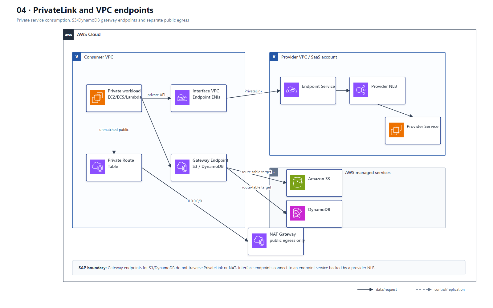
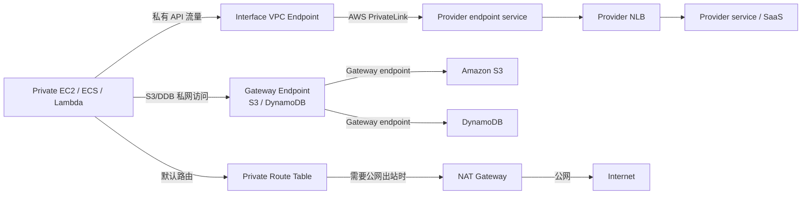

# 04 PrivateLink、VPC Endpoint 与私有服务访问

> 系列：AWS SAP-C02 经典架构（20 场景）
>
> 架构语义已按 AWS 官方资料审计。当前工作区未包含 `aws-sap-c02-529-questions副本.md`，因此题号映射为 **NOT VERIFIED**，不应把代表题号视为已复核事实。

## AWS 架构图

可编辑源图：[04-privatelink-endpoints.svg](diagrams/04-privatelink-endpoints.svg)

## 核心架构

## 题库反复考的决策

| 判断问题 | 优先架构/服务 | 代表题号 |
|---|---|---|
| 访问第三方 AWS-hosted SaaS 且不能经过公网 | Interface Endpoint + PrivateLink | Q12 |
| S3 大流量从私有子网访问 | S3 Gateway VPC Endpoint，降低 NAT 成本 | Q40 |
| 只暴露单个服务而非整张网络 | PrivateLink 优于 VPC Peering | Q172、Q255、Q389 |
| AWS API 私网访问 | Interface VPC Endpoint + endpoint policy / SG | Q247、Q349、Q471 |

## 架构审计要点

- Gateway Endpoint 主要用于 S3/DynamoDB；Interface Endpoint 基于 ENI/PrivateLink。
- PrivateLink 是服务级连接，不需要交换整张 VPC 路由表，因此常用于 SaaS 和跨账户服务。
- S3/DynamoDB Gateway Endpoint 是路由表目标，不经过 PrivateLink、NAT Gateway 或 Internet Gateway。
- NAT Gateway 只保留给与这些 endpoint 无关的公网出站流量。

## 覆盖的代表题

Q12, Q40, Q115, Q172, Q218, Q230, Q243, Q247, Q255, Q269, Q283, Q331, Q349, Q389, Q393, Q400, Q440, Q446, Q463, Q471, Q521, Q529

---

## 系列导航

- 上一篇：[03 混合网络 Direct Connect、VPN 与 Route 53 Resolver](./03_混合网络_Direct_Connect_VPN_与_Route53_Resolver.md)
- 系列总览：[01 Organizations 多账户治理与 Landing Zone](./01_Organizations_多账户治理与_Landing_Zone.md)
- 下一篇：[05 全球入口 CloudFront、Global Accelerator、Route 53 与 WAF](./05_全球入口_CloudFront_Global_Accelerator_Route53_与_WAF.md)
