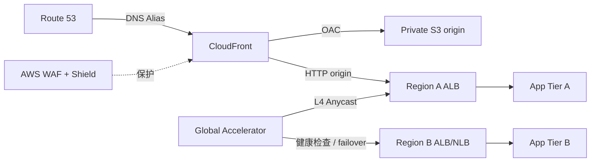

# 05 全球入口 CloudFront、Global Accelerator、Route 53 与 WAF

> 系列：AWS SAP-C02 经典架构（20 场景）
>
> 架构语义已按 AWS 官方资料审计。当前工作区未包含 `aws-sap-c02-529-questions副本.md`，因此题号映射为 **NOT VERIFIED**，不应把代表题号视为已复核事实。

## AWS 架构图

可编辑源图：[05-global-edge.svg](diagrams/05-global-edge.svg)

## 核心架构

## 题库反复考的决策

| 判断问题 | 优先架构/服务 | 代表题号 |
|---|---|---|
| 静态/HTTP 内容全球缓存 | CloudFront；可配置 custom error / origin failover | Q10、Q16、Q36 |
| 需要固定 Anycast IP、TCP/UDP 或快速网络层切换 | Global Accelerator | Q52、Q155、Q167、Q209 |
| DNS 级地域/延迟/故障切换 | Route 53 routing policy + health checks | Q8、Q143、Q296、Q372 |
| Web 防攻击 | AWS WAF；DDoS 场景结合 Shield | Q159、Q199、Q388、Q500 |

## 架构审计要点

- CloudFront 与 Global Accelerator 解决的问题不同：前者是 CDN/L7，后者是基于 AWS 全球骨干网的 L4 Anycast 加速。
- Route 53 负责 DNS 决策，不能替代应用层缓存或网络层 Anycast。
- Global Accelerator 的标准 endpoint 是 ALB、NLB、EC2 或 EIP，不能把 API Gateway 直接画成 GA endpoint。
- 私有 S3 origin 应使用 CloudFront Origin Access Control（OAC）；CloudFront 与 GA 通常是按协议与缓存需求选择的入口方案。

## 覆盖的代表题

Q5, Q10, Q16, Q28, Q36, Q52, Q81, Q107, Q143, Q155, Q159, Q162, Q167, Q169, Q189, Q194, Q199, Q208, Q209, Q251, Q260, Q296, Q312, Q335, Q372, Q384, Q388, Q426, Q427, Q500

---

## 系列导航

- 上一篇：[04 PrivateLink、VPC Endpoint 与私有服务访问](./04_PrivateLink_VPC_Endpoint_与私有服务访问.md)
- 系列总览：[01 Organizations 多账户治理与 Landing Zone](./01_Organizations_多账户治理与_Landing_Zone.md)
- 下一篇：[06 Multi-Region 容灾与自动 Failover](./06_Multi-Region_容灾与自动_Failover.md)
