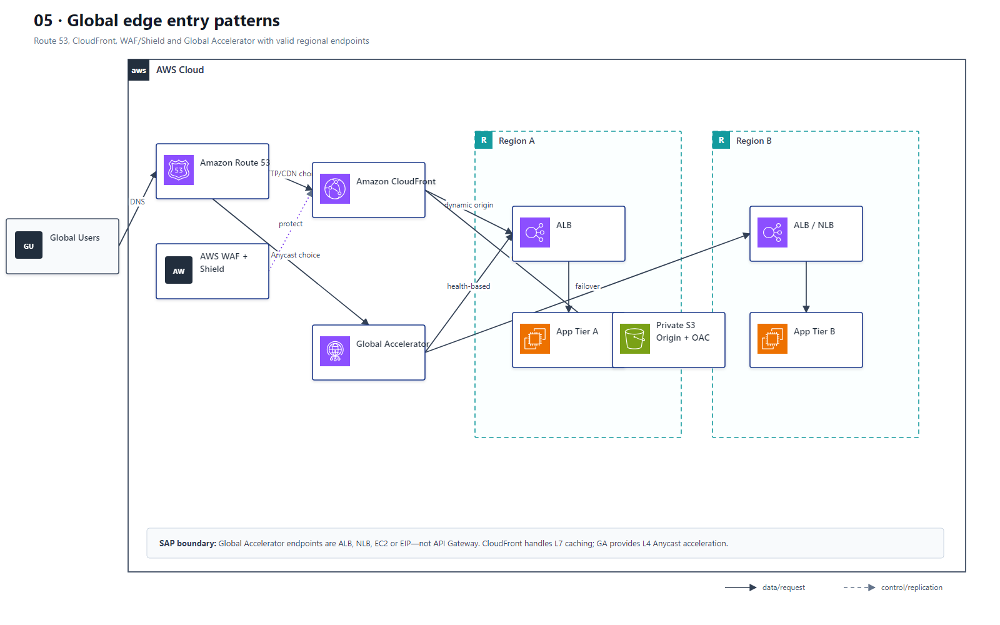

# 05 全球入口 CloudFront、Global Accelerator、Route 53 与 WAF

## AWS 架构图

## 关键架构决策

| 架构需求 | 推荐设计 |
|---|---|
| 静态/HTTP 内容全球缓存 | CloudFront；可配置 custom error / origin failover |
| 需要固定 Anycast IP、TCP/UDP 或快速网络层切换 | Global Accelerator |
| DNS 级地域/延迟/故障切换 | Route 53 routing policy + health checks |
| Web 防攻击 | AWS WAF；DDoS 场景结合 Shield |

## 架构设计要点

- CloudFront 与 Global Accelerator 解决的问题不同：前者是 CDN/L7，后者是基于 AWS 全球骨干网的 L4 Anycast 加速。
- Route 53 负责 DNS 决策，不能替代应用层缓存或网络层 Anycast。
- Global Accelerator 的标准 endpoint 是 ALB、NLB、EC2 或 EIP，不能把 API Gateway 直接画成 GA endpoint。
- 私有 S3 origin 应使用 CloudFront Origin Access Control（OAC）；CloudFront 与 GA 通常是按协议与缓存需求选择的入口方案。
