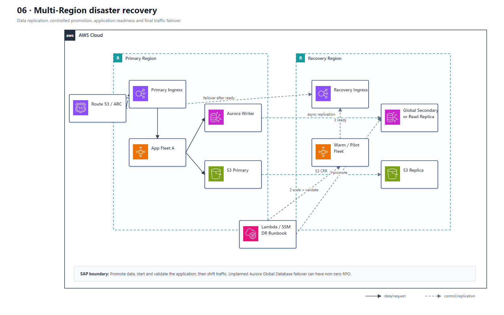
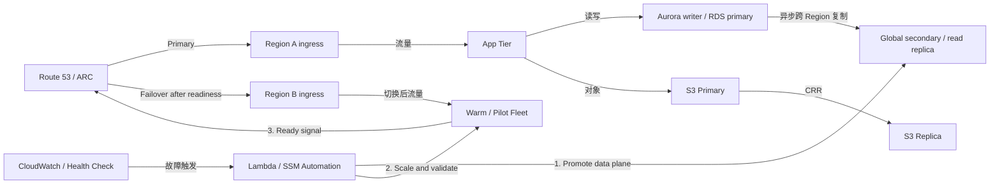

# 06 Multi-Region 容灾与自动 Failover

> 系列：AWS SAP-C02 经典架构（20 场景）
>
> 架构语义已按 AWS 官方资料审计。当前工作区未包含 `aws-sap-c02-529-questions副本.md`，因此题号映射为 **NOT VERIFIED**，不应把代表题号视为已复核事实。

## AWS 架构图

可编辑源图：[06-multi-region-dr.svg](diagrams/06-multi-region-dr.svg)

## 核心架构

## 题库反复考的决策

| 判断问题 | 优先架构/服务 | 代表题号 |
|---|---|---|
| Serverless API 跨 Region | 第二套 API Gateway/Lambda + Route 53 failover + DynamoDB Global Tables | Q2 |
| 低成本且 RTO < 15 分钟 | Pilot Light / Warm Standby + 自动提升 DB + 扩容 + DNS failover | Q8 |
| 关系型数据库跨 Region | Cross-Region read replica / Aurora Global Database，故障时 promote | Q148、Q202、Q298 |
| 对象跨 Region | S3 Cross-Region Replication + CloudFront origin group | Q36、Q190、Q426 |

## 架构审计要点

- 先从题目 RTO/RPO 和预算判断 DR 模式：Backup/Restore → Pilot Light → Warm Standby → Active/Active。
- “已有备 Region ASG min=max=0 + DB read replica”通常是在暗示 pilot-light 自动化切换。
- 自动恢复顺序应是“提升数据库 → 启动并验证应用 → 最后切 DNS/流量”，不能先把用户导向未就绪 Region。
- Aurora Global Database 非计划故障转移为异步复制，可能出现非零 RPO；只有计划内 switchover 才能以数据同步为前提达到 RPO 0。

## 覆盖的代表题

Q2, Q8, Q69, Q135, Q148, Q160, Q169, Q177, Q184, Q190, Q202, Q234, Q240, Q272, Q296, Q298, Q312, Q327, Q333, Q345, Q372, Q389, Q390, Q395, Q406, Q426, Q429, Q448, Q462, Q472

---

## 系列导航

- 上一篇：[05 全球入口 CloudFront、Global Accelerator、Route 53 与 WAF](./05_全球入口_CloudFront_Global_Accelerator_Route53_与_WAF.md)
- 系列总览：[01 Organizations 多账户治理与 Landing Zone](./01_Organizations_多账户治理与_Landing_Zone.md)
- 下一篇：[07 高可用三层 Web 与数据库伸缩](./07_高可用三层_Web_与数据库伸缩.md)
