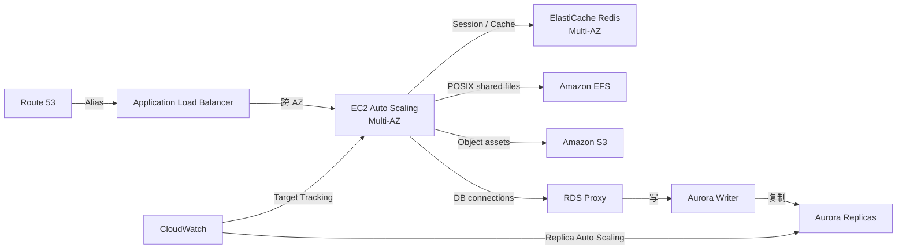

# 07 高可用三层 Web 与数据库伸缩

> 系列：AWS SAP-C02 经典架构（20 场景）
>
> 架构语义已按 AWS 官方资料审计。当前工作区未包含 `aws-sap-c02-529-questions副本.md`，因此题号映射为 **NOT VERIFIED**，不应把代表题号视为已复核事实。

## AWS 架构图

可编辑源图：[07-ha-three-tier.svg](diagrams/07-ha-three-tier.svg)

## 核心架构

## 题库反复考的决策

| 判断问题 | 优先架构/服务 | 代表题号 |
|---|---|---|
| 有状态 Web 横向扩展 | ALB sticky sessions 或外置 session；ASG 跨 AZ | Q4 |
| 数据库高可用 | RDS/Aurora Multi-AZ；只读伸缩使用 replicas | Q9、Q37 |
| 突发连接数压垮数据库 | RDS Proxy / connection pooling | Q272、Q318 |
| 缓存层不能单点 | ElastiCache Redis replication group + Multi-AZ | Q9、Q189、Q396 |

## 架构审计要点

- Multi-AZ 主要解决 HA；Read Replica 主要解决读取扩展，两者不要混淆。
- NLB/ALB 的选择取决于协议和 L7 能力；HTTP 路由、sticky session 通常是 ALB。
- 会话优先外置到 Redis/DynamoDB 等共享状态；只有应用无法改造时才依赖 ALB sticky session。
- EFS 是共享 POSIX 文件系统，S3 是对象存储，不能用“EFS / S3”掩盖两者语义差异。
- Aurora Replica Auto Scaling 的目标是 reader 实例，不是 writer。

## 覆盖的代表题

Q4, Q9, Q16, Q33, Q37, Q45, Q50, Q52, Q61, Q69, Q125, Q189, Q195, Q207, Q217, Q272, Q318, Q335, Q342, Q354, Q368, Q374, Q396, Q437, Q444, Q461, Q481

---

## 系列导航

- 上一篇：[06 Multi-Region 容灾与自动 Failover](./06_Multi-Region_容灾与自动_Failover.md)
- 系列总览：[01 Organizations 多账户治理与 Landing Zone](./01_Organizations_多账户治理与_Landing_Zone.md)
- 下一篇：[08 Serverless API 与无服务器数据层](./08_Serverless_API_与无服务器数据层.md)
