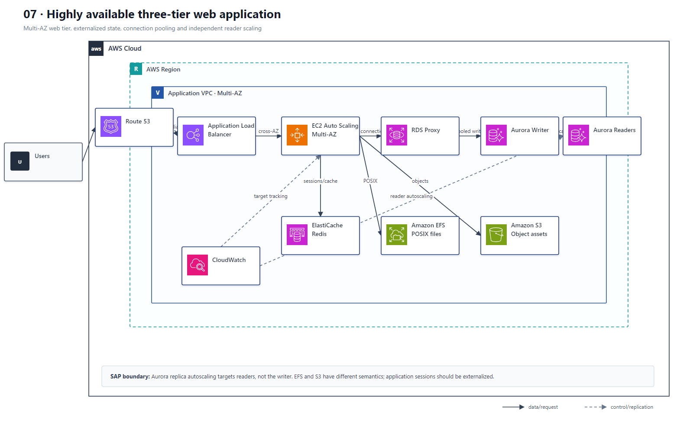

# 07 高可用三层 Web 与数据库伸缩

## AWS 架构图

## 关键架构决策

| 架构需求 | 推荐设计 |
|---|---|
| 有状态 Web 横向扩展 | ALB sticky sessions 或外置 session；ASG 跨 AZ |
| 数据库高可用 | RDS/Aurora Multi-AZ；只读伸缩使用 replicas |
| 突发连接数压垮数据库 | RDS Proxy / connection pooling |
| 缓存层不能单点 | ElastiCache Redis replication group + Multi-AZ |

## 架构设计要点

- Multi-AZ 主要解决 HA；Read Replica 主要解决读取扩展，两者不要混淆。
- NLB/ALB 的选择取决于协议和 L7 能力；HTTP 路由、sticky session 通常是 ALB。
- 会话优先外置到 Redis/DynamoDB 等共享状态；只有应用无法改造时才依赖 ALB sticky session。
- EFS 是共享 POSIX 文件系统，S3 是对象存储，不能用“EFS / S3”掩盖两者语义差异。
- Aurora Replica Auto Scaling 的目标是 reader 实例，不是 writer。
