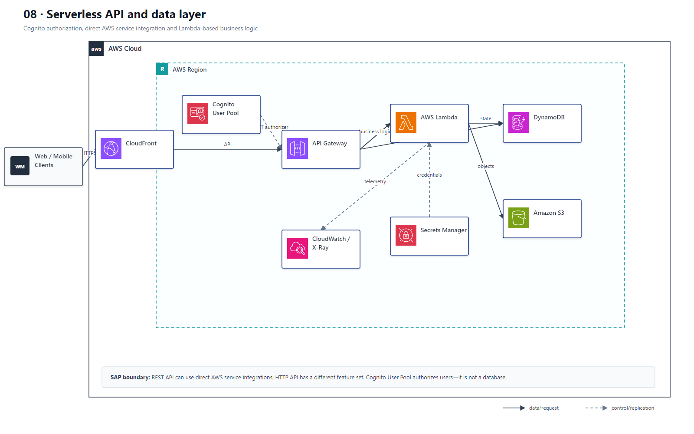

# 08 Serverless API 与无服务器数据层

## AWS 架构图

## 关键架构决策

| 架构需求 | 推荐设计 |
|---|---|
| 简单 HTTPS → DynamoDB | API Gateway REST API direct AWS integration，可省 Lambda |
| 需要业务逻辑 | API Gateway + Lambda + DynamoDB |
| 用户认证 | Cognito + API authorizer / IAM |
| 全球高可用 | 每 Region 部署完整 serverless stack + Route 53 + Global Tables |

## 架构设计要点

- SAP 题里经常问“最少运维开销”：能用托管集成就不要自己维护 EC2。
- HTTP API 与 REST API 的 feature set 不同，需要 AWS 服务直连集成时要注意支持范围。
- REST API 的 AWS service integration 可直接调用支持的 AWS 服务动作；不要把所有 API 都强制绕过 Lambda，也不要假设 HTTP API 具备完全相同的能力。
- 多 Region serverless 需要完整复制 API、函数、密钥/配置和数据层；DynamoDB Global Tables 只解决 DynamoDB 的跨 Region 数据复制。
