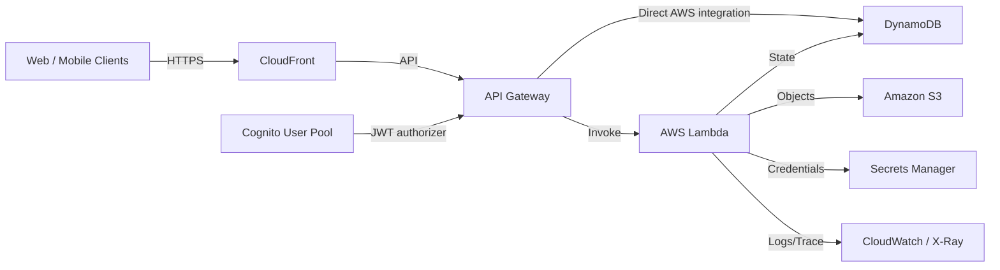

# 08 Serverless API 与无服务器数据层

> 系列：AWS SAP-C02 经典架构（20 场景）
>
> 架构语义已按 AWS 官方资料审计。当前工作区未包含 `aws-sap-c02-529-questions副本.md`，因此题号映射为 **NOT VERIFIED**，不应把代表题号视为已复核事实。

## AWS 架构图

可编辑源图：[08-serverless-api.svg](diagrams/08-serverless-api.svg)

## 核心架构

## 题库反复考的决策

| 判断问题 | 优先架构/服务 | 代表题号 |
|---|---|---|
| 简单 HTTPS → DynamoDB | API Gateway REST API direct AWS integration，可省 Lambda | Q27 |
| 需要业务逻辑 | API Gateway + Lambda + DynamoDB | Q2、Q22、Q207 |
| 用户认证 | Cognito + API authorizer / IAM | Q81、Q94 |
| 全球高可用 | 每 Region 部署完整 serverless stack + Route 53 + Global Tables | Q2、Q296 |

## 架构审计要点

- SAP 题里经常问“最少运维开销”：能用托管集成就不要自己维护 EC2。
- HTTP API 与 REST API 的 feature set 不同，题目明确要求 AWS service direct integration 时要注意支持范围。
- REST API 的 AWS service integration 可直接调用支持的 AWS 服务动作；不要把所有 API 都强制绕过 Lambda，也不要假设 HTTP API 具备完全相同的能力。
- 多 Region serverless 需要完整复制 API、函数、密钥/配置和数据层；DynamoDB Global Tables 只解决 DynamoDB 的跨 Region 数据复制。

## 覆盖的代表题

Q2, Q22, Q27, Q33, Q45, Q48, Q54, Q63, Q73, Q80, Q81, Q94, Q95, Q106, Q107, Q120, Q129, Q135, Q150, Q154, Q155, Q160, Q207, Q285, Q296, Q317, Q330, Q378, Q421, Q485, Q497

---

## 系列导航

- 上一篇：[07 高可用三层 Web 与数据库伸缩](./07_高可用三层_Web_与数据库伸缩.md)
- 系列总览：[01 Organizations 多账户治理与 Landing Zone](./01_Organizations_多账户治理与_Landing_Zone.md)
- 下一篇：[09 Event-Driven 解耦与工作流编排](./09_Event-Driven_解耦与工作流编排.md)
