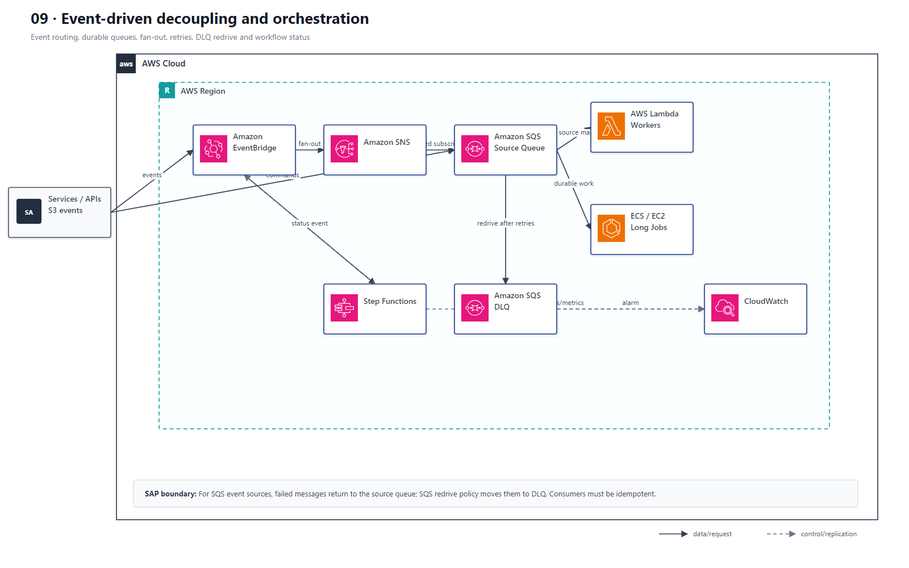
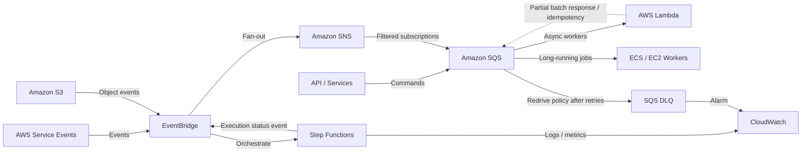

# 09 Event-Driven 解耦与工作流编排

> 系列：AWS SAP-C02 经典架构（20 场景）
>
> 架构语义已按 AWS 官方资料审计。当前工作区未包含 `aws-sap-c02-529-questions副本.md`，因此题号映射为 **NOT VERIFIED**，不应把代表题号视为已复核事实。

## AWS 架构图

可编辑源图：[09-event-driven.svg](diagrams/09-event-driven.svg)

## 核心架构

## 题库反复考的决策

| 判断问题 | 优先架构/服务 | 代表题号 |
|---|---|---|
| 服务间缓冲 / 削峰 | SQS；根据 backlog 扩缩 worker | Q42、Q212 |
| 一条事件分发多个消费者 | SNS fan-out / EventBridge rules | Q44、Q133、Q173 |
| 复杂顺序、重试、补偿 | Step Functions | Q100、Q134、Q171、Q277 |
| 长达 1 小时任务 | 不要用 Lambda；SQS + EC2/ECS workers | Q42 |

## 架构审计要点

- EventBridge 更适合事件路由；SQS 更适合 durable queue/backpressure；SNS 更适合 pub/sub fan-out。
- 长任务首先检查 Lambda 最大执行时长，超过边界要转容器/EC2/Batch。
- SQS 事件源映射失败时，消息返回源队列；达到 `maxReceiveCount` 后由 SQS redrive policy 移入 DLQ，不是 Lambda 直接把事件发送到该 DLQ。
- 批处理消费者应启用 partial batch response，并以幂等写入防止至少一次投递造成重复副作用。

## 覆盖的代表题

Q14, Q42, Q44, Q68, Q94, Q95, Q100, Q107, Q117, Q133, Q134, Q141, Q144, Q145, Q166, Q171, Q173, Q179, Q180, Q197, Q212, Q224, Q226, Q239, Q252, Q271, Q277, Q288, Q291, Q338, Q346, Q376, Q404, Q408, Q474

---

## 系列导航

- 上一篇：[08 Serverless API 与无服务器数据层](./08_Serverless_API_与无服务器数据层.md)
- 系列总览：[01 Organizations 多账户治理与 Landing Zone](./01_Organizations_多账户治理与_Landing_Zone.md)
- 下一篇：[10 ECS、EKS、Fargate 容器平台](./10_ECS_EKS_Fargate_容器平台.md)
